# Ring of Fire

## The Handgun Makers of Southern California

**A Report from the Violence Prevention Research Program**

*By Garen J. Wintemute, MD, MPH*

---

> **About this edition.** This is a faithful digital transcription of the original 1994 printed report, reformatted as clean Markdown for easy conversion to other formats. The text, data, and figures reflect the report as published in 1994; nothing has been factually updated or altered. The original cover, charts, facility photographs, and pistol photographs are reproduced here as cropped scanned images, each with descriptive alt text for screen-reader access and an accompanying caption that describes the figure's content and key data. The BATF factoring criteria (printed as "Figure 5-1"/Table 5-1 in the original) are given as an accessible data table rather than an image. Original page numbers are preserved in section headers where useful, and the complete reference list appears at the end.

---

### Publication information

The Violence Prevention Research Program is located at the University of California, Davis. Its work addresses the causes, nature, and prevention of firearm violence.

The Ring of Fire project was supported in part by a grant from The California Wellness Foundation.

This report was researched and written by Garen Wintemute and produced by VPRP staff Barbara Claire, Michael Romero, Carrie Akin, Melissa Garcia, Vanessa Garcia, Kevin Grassel, Susan Hildreth, Heidi Smith, and Mona Wright. Thanks to Ken Kizer, Deborah Leff, Ellen Robinson-Haynes, Stephen Teret, and Jon Vernick for editorial comments. Confiscated firearms were made available by the Sacramento Police Department.

**Suggested citation:** Wintemute, GJ. *Ring of Fire: The Handgun Makers of Southern California.* Sacramento, CA: Violence Prevention Research Program, 1994.

© 1994 by Garen Wintemute.

**Mailing address:**
Violence Prevention Research Program
University of California, Davis
Western Fairs Building
2315 Stockton Blvd.
Sacramento, CA 95817

---

> [T]he consensus is that no more than five to ten people in a hundred who die by gunfire in Los Angeles are any loss to society. These people fight small wars amongst themselves. It would seem a valid social service to keep them well-supplied with ammunition.
>
> — *NRA Official Jeff Cooper,* Guns & Ammo, *April 1991*

> The only thing necessary for the triumph of evil is for good men to do nothing.
>
> — *Attributed to Edmund Burke*

---

## Contents

- [Summary](#summary)
- [Introduction](#introduction)
- [The "Saturday Night Special" Family](#the-saturday-night-special-family)
- [Ring of Fire Companies and What They Make](#ring-of-fire-companies-and-what-they-make)
- [How Ring of Fire Companies Sell Their Guns](#how-ring-of-fire-companies-sell-their-guns)
- [Ring of Fire Guns and Crime](#ring-of-fire-guns-and-crime)
- [How They Get Away with It](#how-they-get-away-with-it)
- [What You Can Do](#what-you-can-do)
- [Appendix 1: Additional Southern California Manufacturers](#appendix-1-additional-southern-california-manufacturers)
- [Appendix 2: A Primer on Guns](#appendix-2-a-primer-on-guns)
- [Appendix 3: Elected Representatives](#appendix-3-elected-representatives)
- [References](#references)
- [Addendum to "Ring of Fire Companies and What They Make"](#addendum-to-ring-of-fire-companies-and-what-they-make)

---

# Summary

Advocates for firearm violence prevention should recognize the importance of affecting the manufacture and distribution of firearms, as well as the behavior of people who use them.

This report describes a small group of handgun manufacturers in Southern California, called here the Ring of Fire manufacturers. These companies produce the great majority of Saturday Night Specials made in the United States. Such small, inexpensive handguns are disproportionately involved in violence, and figure in thousands of firearm crimes each year.

The six Ring of Fire manufacturers are Arcadia Machine and Tool (AMT), in Irwindale; Bryco Arms, in Costa Mesa; Davis Industries, in Mira Loma; Lorcin Engineering, also in Mira Loma; Phoenix Arms, in Ontario; and Sundance Industries, in Valencia. All but AMT are controlled at least in part by members of a single extended family.

In 1992, the most recent year for which data are available, the Ring of Fire companies produced 685,934 handguns — 34% of all handguns made in the United States. From 1990–1992 their production increased by more than 20 percent each year; handgun output declined for the rest of the industry during that period.

The Ring of Fire companies dominate the production of easily concealable, inexpensive handguns. In 1992, they made over 80 percent of the .25 ACP, .32 ACP, and .380 ACP pistols produced in this country. Their rapid growth has largely come from increased production of medium-caliber .380 ACP pistols, guns with the small size and low cost of other Saturday Night Specials but with greater power.

Firearms experts consider most Ring of Fire guns to be poorly made, unreliable, and in some cases unsafe. Few of these guns could legally be imported into the United States if made elsewhere. They would be too small — too easily concealable — to meet minimum federal standards, or would fail other required design and performance tests.

Ring of Fire handguns are marketed primarily as a reliable means of personal protection. The results of objective expert evaluations suggest that the guns are not well suited for this purpose.

Ring of Fire guns are disproportionately used in crime. Across the country, lists of guns most frequently confiscated by law enforcement agencies are dominated by Ring of Fire handguns. According to gun tracing data from the Bureau of Alcohol, Tobacco, and Firearms (BATF), Ring of Fire guns are 3.4 times as likely to be involved in a crime as are handguns from other major manufacturers.

The Ring of Fire manufacturers and other Saturday Night Special makers are a protected industry in the United States. Federal law prohibits the importation of poorly made, easily concealable handguns by imposing size, design, and performance standards. Guns made in the United States have deliberately been exempted by Congress and no such standards apply. Congress has also prohibited federal regulatory agencies such as BATF and the Consumer Product Safety Commission from taking action.

The state of Maryland has acted independently to ban the manufacture and sale of many Ring of Fire handguns and others like them. Local jurisdictions around the country have enacted broad controls on handgun manufacture and possession. The available evidence indicates that such laws are effective firearm violence prevention measures. They have popular support, and are constitutional. But in much of the country, local jurisdictions are prohibited from acting by state preemption statutes.

To halt the production of Saturday Night Specials in the United States, federal and state governments — and particularly California's state government — should require that guns made under their jurisdiction meet the criteria applied to imports. These criteria need to be revised to address new developments in handgun technology.

States should restore to local jurisdictions the authority to enact controls on the manufacture, sale and possession of handguns.

---

# Introduction

The nude body of a 34-year-old woman is found at the foot of a dead-end street. She has been shot three times. Four shell casings are found at the scene. The handgun used to shoot her is a Lorcin L-380 pistol.

A 21-year-old woman is shot to death by her husband, who then kills himself. The couple had separated; the woman and their infant child were living at her parents' home. The gun is a Jennings J-22 pistol.

A 15-year-old fires at a policeman from the rooftop of an apartment building; the policeman is struck in the ankle. "Damn! I wanted to bust him in the cabbage," the shooter is reported to have said. The gun is a Raven .25 caliber pistol.

A 7-year-old boy takes a loaded gun to school and threatens to shoot a schoolmate. The gun is a Jennings J-25 pistol.

Each of these actual events — and many thousands like them every year — involve handguns made in Southern California. This report is about those handguns, the people and companies that make them, and the terrible damage they do.

Americans are familiar with the use of the term "Ring of Fire" to describe the chain of volcanoes that rings the Pacific Ocean. We have borrowed the term here to describe the chain of handgun manufacturers that rings the Los Angeles metropolitan area. Each year, hundreds of thousands of small, inexpensive handguns leave these factories for destinations throughout the United States.

Compared to other better-known classes of firearms, like assault-type weapons and large 9mm pistols, Ring of Fire handguns seem quite ordinary. Certainly they lack the fearsome appearance and high-power ballistics of other firearms. Yet these ordinary guns, made the more readily available for criminal use by their easy concealability and low cost, make up the lion's share of guns used in crime.

Our current efforts to control firearm violence focus on the behavior of people who use guns. These efforts largely ignore American gun manufacturers and the guns they make. Yet our experience with motor vehicles, tobacco products, and alcoholic beverages has taught us that there is great value to the public interest in directly affecting the design, manufacture, and marketing of hazardous consumer products. In fact, our success in preventing motor vehicle deaths has been such that in 1994 we are likely to have more gun deaths than motor vehicle deaths in the United States.

It is time to apply the lessons learned in preventing injuries and diseases from other hazardous products to the control of firearm violence. There is no better place to start than with the Ring of Fire manufacturers. As this report will demonstrate, these companies produce the 1990s descendants of the Saturday Night Specials of the 1960s and '70s — poorly made, easily concealable handguns that are disproportionately used in crime. They are producing ever more powerful guns, in ever-increasing numbers. And they are concentrated geographically, in one corner of a single state.

This report serves several purposes. First, it provides detailed information on the origin and operation of the Ring of Fire handgun makers, an assessment of the guns they make, and a review of their marketing tactics. (Profiles of smaller California manufacturers are given in Appendix 1.)

Much of this information comes from data gathered by the Bureau of Alcohol, Tobacco and Firearms (BATF). Most of the remainder has appeared in firearms industry periodicals. Some readers will find the technical details of handgun design and production to be uninteresting or even irrelevant. However, as our country's successes with motor vehicles and tobacco products have shown, product-based interventions should be based on a thorough understanding of the products they address. (A number of the technical details are clarified in Appendix 2.)

Next, the report examines the role Ring of Fire guns play in firearm violence. The data for this analysis are taken from crime surveillance information maintained by BATF and the National Institute of Justice (a branch of the federal Department of Justice), and from reports by local police agencies.

The report then reviews the major legislative and court actions that have not only permitted the activities of the Ring of Fire companies but have encouraged and protected those activities. This review also includes the most important instances in which legislatures, the courts, or the voters themselves have acted to prevent firearm violence by directly regulating the making and selling of handguns.

Last, based on these instances and the lessons of other successful public health campaigns, the report seeks to bridge the gap between research and advocacy and proposes an array of community and legislative interventions focused on Ring of Fire guns.

This report is intended in part for the citizens and policymakers of California, in whose collective backyard the nation's Saturday Night Special industry now resides. Californians have opportunities for action to control the production and distribution of these firearms that are not available to others. They also have a special responsibility to their neighbors throughout the United States to intervene for the benefit of all of us.

For all Americans and for our national leadership, this report can help provide the framework for effective product-based firearm violence prevention policies. It is time for the attention of the nation to be focused on the terrible damage done by the Ring of Fire companies to our country's safety, health and well-being.
---

# The "Saturday Night Special" Family

The story of the Ring of Fire gun manufacturers is largely that of the Jennings family. This one family's quest after the American dream has done much to engender our uniquely American nightmare of firearm violence.

Our knowledge of the Jennings family and their remarkable gun-making empire is due largely to the efforts of reporter Alix M. Freedman. In February 1992, Freedman published an extensive report on the life and times of the Jennings family in the *Wall Street Journal.* Her article makes fascinating reading and is highly recommended. The following paragraphs are largely drawn from it, and all the quotations are from the article.

The story begins with George Jennings. Raised in southern Kansas, Jennings hitchhiked west in the 1940s to find his future. He began as a laborer, but by the late 1960s ran a machine shop that made airplane parts. Soon after, Congress passed the Gun Control Act of 1968, which outlawed the importation of small, cheaply made handguns but not their manufacture in the United States. Jennings' business put him in an ideal position to move into this newly protected industry. He designed a pistol in .25 ACP (Automatic Colt Pistol) caliber and spent about $50,000 tooling up; Raven Arms was in business by 1970.

In reporter Freedman's estimation, George Jennings "all but created the high-volume market for cheap handguns." George's son Bruce, now in his mid-40s, trained with his father at Raven Arms but left in 1978 to form Jennings Firearms. George's daughter Gail and her husband Jim Davis, who had been Raven Arms' office manager, established Davis Industries in 1982.

> **"Money became the God."**
> — John Davis, Davis Industries and Lorcin Engineering

[*The remaining founders:* Jim Waldorf, Bruce's high school friend, founded Lorcin Engineering in 1989; George's nephew founded Sundance Industries in 1989. Unlike the publicity-shy members of the Jennings family — who have been known to hide in their cars from television cameras — Waldorf aggressively defends his firm in legislative testimony and media appearances.]

Although they have been very successful economically, the members of the Jennings family might not make the short list of business people one would like to emulate. Shortly before the publication of Freedman's article, George Jennings "settled a nasty sexual-harassment suit filed by his former receptionist." A six-year relationship apparently began when Jennings "handed her a pink message slip on which he had written: 'Changes will be made in regard to your sexual activities.'" During their relationship the receptionist was promoted to office manager and vice president, and became a member of Raven's board of directors.

Son Bruce is a self-described "full-time womanizer" and a convicted wife-beater. Freedman writes that at Christmastime 1984, Bruce broke his wife's jaw and described the beating as "her Merry Christmas" to police.

As a result, Bruce Jennings took his company through a remarkable series of corporate gymnastics that triggered formal investigations by both BATF and the Internal Revenue Service (IRS). Facing a possible felony conviction for spousal abuse in 1985, which would have led to the loss of his license to manufacture and distribute firearms, Bruce Jennings sold Jennings Firearms to its former office manager and the firm was renamed Calwestco. Jennings himself ostensibly left the business.

He then created a new manufacturer, Bryco Arms (named for his son Brian), which was nominally controlled by his ex-wife. According to BATF records, Bryco made guns in Nevada for just one year, 1988, then moved to Calwestco's facility in Irvine, California.

After serving his jail sentence, Jennings established a gun wholesaler — again named Jennings Firearms — that bought guns from Calwestco and Bryco. The IRS became involved when BATF investigators concluded that Bruce Jennings in fact controlled Calwestco and Bryco, as well as the new Jennings Firearms, and that the three-company business structure was part of a "scheme to avoid full payment of excise taxes." (The federal excise tax on firearms is assessed against manufacturers. The government alleged that Calwestco and Bryco kept their selling prices artificially low, thus minimizing tax payments. The markup, according to the allegation, was shifted to Jennings Firearms' sales to distributors.)

By 1991, Calwestco had ceased manufacturing and sold its equipment to Bryco Arms, which remains the active manufacturer today. Bryco's guns are still sold through Jennings Firearms, now a Nevada wholesaler.

Raven Arms, the firm that started it all, no longer exists. The plant was seriously damaged by fire in November 1991. But Raven's tooling was sold to another family firm, the newly created (and poetically named) Phoenix Arms. Freedman cites Bruce Jennings as saying the company is "equally owned by his ex-wife, Janice, and his three children; by Jim Davis' four children; and by Dave Brazeau, the Raven general manager."

> **Figure 1-1: The Ring of Fire Family Tree — History of the Five Jennings-Related Companies**
>
> | Origin company | Founder / relation | Became | 1992 production |
> |---|---|---|---|
> | Lorcin Engineering | Jim Waldorf, Bruce's high school friend (1989) | Lorcin Engineering | 187,761 guns |
> | Davis Industries | George's daughter Gail and husband Jim Davis (1982) | Davis Industries | 187,779 guns |
> | Raven Arms | George Jennings (1970); Raven destroyed by fire, 1991 | Phoenix Arms | 67,824 guns |
> | Jennings Firearms | George's son Bruce (1978); Jennings replaced by Calwestco, 1985–1990 | Bryco Arms | 204,883 guns |
> | Sundance Industries | George's nephew (1989) | Sundance Industries | 17,757 guns |

<!--CHART figure-1-1-->

George Jennings himself, now in his mid-60s, is theoretically retired. According to reporter Freedman, he lives on a "sun-drenched villa" in Rancho Mirage, California, complete with an olive grove, grape vines, and lemon trees. At the time of Freedman's article in 1992, Jim Davis also lived in Rancho Mirage, at a mansion called Big Sioux; George's son Bruce lived in Newport Beach in a house known locally as the castle.

In 1992, it appeared to those most involved that the good times were ending for the Jennings family. Reporter Freedman quotes Jim Waldorf of Lorcin Engineering: "The Jennings family has controlled the market for 20 years. They're ripe to get picked." And Bruce Jennings whined: "This end of the market is collapsing. We're just going to have a bunch of unprofitable companies."

But neither the dethroning of the Jennings family nor the collapse of the market has occurred, as the next section will demonstrate. Waldorf's Lorcin Engineering may be the fastest growing of the Ring of Fire companies, but the Jennings family remains substantially in control of what continues to be the healthiest segment of the firearms industry.
---

# Ring of Fire Companies and What They Make

The six Ring of Fire companies lie around the outer edge of the Los Angeles metropolitan area; none is more than 45 miles from downtown Los Angeles. In clockwise order from north to south, the companies are Sundance Industries, in Valencia; Arcadia Machine & Tool (AMT), in Irwindale; Phoenix Arms, in Ontario; Davis Industries and Lorcin Engineering, both in Mira Loma; and Bryco Arms, in Costa Mesa. Raven Arms was located in the City of Industry, not far from AMT.

How big are the Ring of Fire manufacturers? Let us consider employment first. In early 1993, Jim Waldorf of Lorcin Engineering told the Judiciary Committee of the California Assembly that his firm employed 130 people. In 1992, Lorcin produced 187,761 handguns. With the partial exception of AMT, the Ring of Fire companies produce very similar handguns by similar methods. For estimation purposes, we can therefore assume that Lorcin's ratio of persons employed to number of guns produced — 1,444 guns per employee per year — applies to the other Ring of Fire manufacturers. On that basis, these companies employed approximately 500 persons at that time.

Size can also be measured in terms of output: handgun production, in this case. In 1992, according to data supplied by BATF, the Ring of Fire manufacturers collectively produced 685,934 handguns. This was 34 percent of all the handguns made in the United States that year — more than enough to supply one to every man, woman, and child in Washington D.C., or Seattle, or New Orleans, or Milwaukee, or Boston. Ring of Fire companies made handguns enough, if each had been used to commit just one crime in 1992, to account for 74 percent of all the handgun crime in the United States that year. (This is not an entirely hypothetical consideration, as we will see in the discussion of Ring of Fire guns and crime.)

> *In 1992, Ring of Fire companies made more than enough guns for each resident of Washington DC, Seattle, New Orleans, Milwaukee, or Boston.*

Long-term production trends for Ring of Fire manufacturers are shown in Figure 2-1. In the early 1980s, the group was led by George Jennings' Raven Arms and his son Bruce's Jennings Firearms. The most dramatic and sustained growth in recent years has come from Davis Industries and Lorcin Engineering, which now rival Bryco Arms (the successor to Jennings Firearms and Calwestco).

> **Figure 2-1: Total Handgun Production for Each of the Ring of Fire Companies, 1984–1992.**
> *(For Bryco and Phoenix, predecessor firms are also included.)*
> A line chart tracking annual handgun output (thousands) for AMT, Bryco, Davis, Lorcin, Phoenix, and Sundance. In the early 1980s the group was led by Raven Arms and Jennings Firearms; by the early 1990s, Bryco, Davis, and Lorcin show the steepest sustained growth.

The Ring of Fire companies present a remarkable example of the concentration of one segment of a major consumer product industry in a small geographic area. At one time, U.S. production of the small inexpensive handguns known as Saturday Night Specials was largely located in south Florida. Many of these companies have gone out of business. It is no exaggeration to say that the Saturday Night Special industry now lives in Southern California.

It would in fact be difficult to overestimate the Ring of Fire firms' dominance in this area. As Figure 2-2 indicates, over 80 percent of the .25 ACP, .32 ACP and .380 ACP pistols produced in this country in 1992 came from Ring of Fire companies. (Their less impressive role in .22-caliber pistol manufacture is misleading. Other major handgun manufacturers produce large numbers of .22-caliber pistols, but their guns generally are manufactured to higher standards, are much larger, and are commonly used for recreational shooting.)

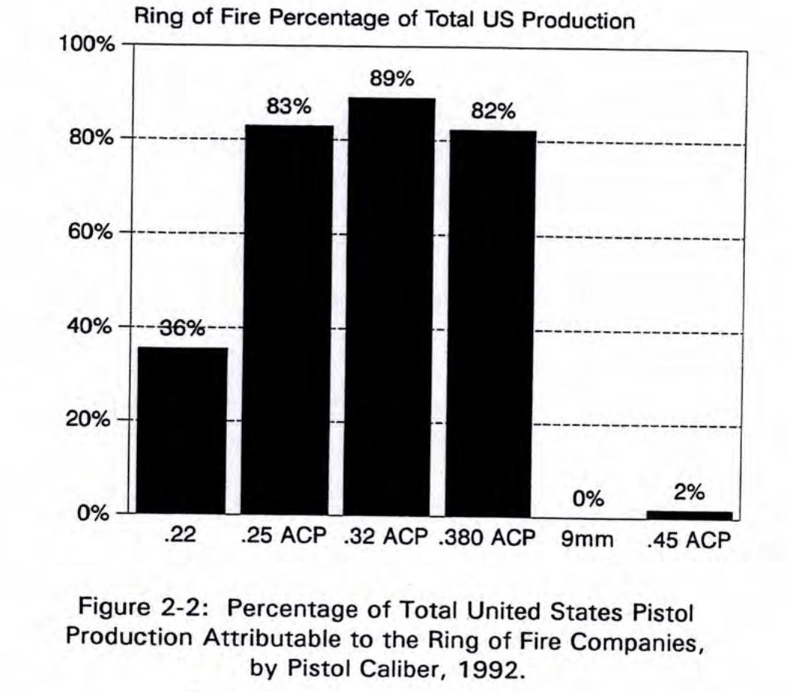

> **Figure 2-2: Percentage of Total United States Pistol Production Attributable to the Ring of Fire Companies, by Pistol Caliber, 1992.**
> A bar chart of the Ring of Fire share of U.S. production by caliber. The .25 ACP, .32 ACP, and .380 ACP categories each exceed 80 percent (peaking at roughly 89 percent), while the .22, 9mm, and .45 ACP shares are substantially smaller.

<!--CHART figure-2-2-->

The focus on cheap handguns turns out to have made very good business sense. Though the 1980s were not kind to the handgun industry generally, the Ring of Fire manufacturers showed sustained growth. In fact, these firms have so dramatically outperformed the rest of the handgun industry that, on the basis of number of guns produced, they will soon capture dominance of the entire industry from its traditional leadership.

Since Eli Whitney built his musket armory in New Haven in the late 1700s, the U.S. firearms industry has been headquartered along the Connecticut River in New England. Gun Valley, as it is known, is home to longtime industry giants like Smith & Wesson, Colt, and Ruger. Recent years have seen a rash of failures and buyouts in Gun Valley. Smith & Wesson is owned by a British conglomerate; Colt remains mired in bankruptcy despite massive aid from the state of Connecticut.

All the while, the Ring of Fire firms have prospered. From 1990 to 1992, their handgun production increased a remarkable 24 percent per year on average, while production for the rest of the handgun industry declined two percent per year. By 1992, Bryco, Davis, and Lorcin ranked respectively third, fourth, and fifth in number of handguns produced among all U.S. manufacturers; Phoenix ranked eighth, although it emerged from Raven's ashes only that year; AMT and Sundance ranked 16th and 17th.

The emerging industry leadership of the Ring of Fire manufacturers can be seen in Figure 2-3. Ten years ago, Smith & Wesson, Colt, and Ruger collectively produced nearly five times as many handguns as the California manufacturers. By 1992 the gap had largely disappeared. If these trends continue, the Ring of Fire firms will surpass these three Gun Valley giants in total handgun production by 1995.

In fact, it may already have happened. While handgun sales have increased for the entire industry since 1992, evidence suggests that the Ring of Fire firms have been particular beneficiaries of this trend. The trade publication *Firearms Business* reported in April 1994 that one unnamed Ring of Fire company faced back orders for more than 80,000 handguns across its product line and for 50,000 guns in just one caliber. According to *Firearms Business,* "[o]thers with similar lines are similarly situated. Some of the larger firms are behind by as many as 50,000–60,000 units."

> *In 1994, individual companies face back orders for 50,000 to 80,000 guns.*

> **Figure 2-3: Trends in Total Handgun Production for Three Major Gun Valley Firearm Manufacturers (Smith & Wesson, Ruger, Colt) and the Ring of Fire Companies, 1984–1992, Projected to 1996.**
> Two trend lines (handguns, thousands). A decade earlier the three Gun Valley giants together produced roughly five times the Ring of Fire output; by 1992 the gap had nearly closed, and the projection has the Ring of Fire companies overtaking the Gun Valley firms by about 1995.

## New and More Powerful Guns

The Ring of Fire companies have by no means rested on their success in the traditional small-caliber Saturday Night Special market. Since 1988, these companies have moved very aggressively into production of medium-caliber .380 ACP and 9mm pistols. The .380 ACP pistol in particular can be made in nearly the same small size as the small-caliber guns with little or no loss in ammunition capacity, and is sold for only a few dollars more.

But the resemblance ends there. The .380 ACP pistol is much more powerful than small-caliber guns. By one standard ballistics measurement, Relative Stopping Power, .380 ACP ammunition has at least twice the wounding potential of the traditional Saturday Night Special calibers. The .380 ACP is considered by experts to be the most powerful ammunition compatible with the inexpensive operating mechanism found in most Ring of Fire handguns.

This ammunition is in fact 9mm caliber, and experts refer to it on occasion as the "9mm short." It differs from standard 9mm ammunition in that it has a lighter bullet and carries a smaller powder charge. The Relative Stopping Power of ammunition used in the most common Ring of Fire handguns is displayed in Figure 2-4. (The method of calculation is given in Appendix 2.)

> *The medium-caliber .380 ACP pistol is now the Ring of Fire manufacturers' number-one gun.*

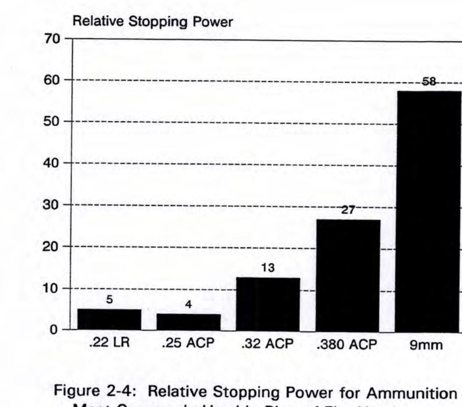

> **Figure 2-4: Relative Stopping Power for Ammunition Most Commonly Used in Ring of Fire Handguns.**
> A bar chart comparing Relative Stopping Power across .22 LR, .25 ACP, .32 ACP, .380 ACP, and 9mm. Stopping power rises sharply with caliber; the .380 ACP carries at least twice the wounding potential of the traditional small-caliber Saturday Night Special rounds, and the 9mm higher still.

<!--CHART figure-2-4-->

The magnitude of this shift into medium-caliber pistol production is remarkable (Figure 2-5). For the Ring of Fire manufacturers as a group, production of .380 ACP handguns increased by more than 20 times between 1988 and 1992; these pistols are now easily their most common product. The three Ring of Fire companies that have shown major growth in the 1990s — Bryco, Davis, and Lorcin — owe most or all of their growth to increases in .380 ACP pistol production. To judge from these three companies' current advertising, more recent production data will show them giving parallel emphasis to the even more powerful 9mm pistol.

These trends have resulted in a major increase in the power of inexpensive, easily concealable handguns. The medium-caliber Saturday Night Special has arrived. The increasing availability of these pistols is very likely to be accompanied by an increase in firearm homicides, serious firearm injuries, and health-care costs for firearm violence.

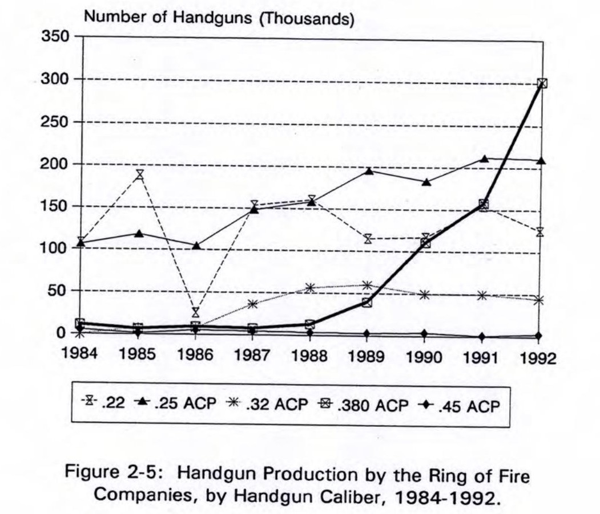

> **Figure 2-5: Handgun Production by the Ring of Fire Companies, by Handgun Caliber, 1984–1992.**
> A line chart of production (thousands) by caliber: .22, .25 ACP, .32 ACP, .380 ACP, and .45 ACP. The .380 ACP line is nearly flat through 1988, then climbs steeply to roughly 300,000 by 1992 — more than a twentyfold increase — overtaking every other caliber.

## Ring of Fire Guns as Hazardous Consumer Products

Ring of Fire handguns may be numerous and increasingly powerful, but are they good for anything? This is not a frivolous question. There is a sizeable objective literature on the quality, reliability, and performance of these guns. Most of this information is published in the magazine *Gun Tests.* The equivalent of *Consumer Reports* for gun buyers, *Gun Tests* accepts no advertising, conducts its own rigorous product evaluations, and seems to be as willing to criticize guns as to praise them. Aside from *Gun Tests,* leading firearms experts from both inside and outside the industry have commented publicly on Ring of Fire handguns.

Most Ring of Fire handguns are viewed negatively, even contemptuously, by gun experts. Serious pro-gunners find the small-caliber pistols to be downright laughable. Massad Ayoob, a leading gun writer, refers to them as "mouse guns."

Jeff Cooper, whose quote on continued violence in Los Angeles appears at the beginning of this report, recounts an anecdote: "We hear of an unfortunate woman who, during a nighttime asthma attack, confused the small handgun she kept under her pillow with an asthma inhaler and proceeded to relieve her symptoms. It was not a fatal mistake, partly because she used a .25 ACP, which everyone knows is not sufficient to clear sinuses."

*Gun Tests,* commenting on the use of .25 ACP pistols for personal defense, dismisses them as "a modern sort of talisman to ward off evil people." But "[t]he .25 ACP outsells nearly everything," the writer admits, "so someone must believe in it."

> **"If someone gave me one as a gift, I'd throw it away."**
> — BATF Gun Expert

Other commentators emphasize the poor quality of Ring of Fire handguns. David Guthrie, a firearms industry analyst for a Memphis brokerage firm, described guns produced by the Jennings family companies as "junky and not reliable." Edward Owen Jr., chief of the Firearms Technology Branch at BATF, said of the Jennings family and their guns, "[T]hey don't do any more to them than they have to to make them work." In a 1994 interview Owen added, "If someone gave me one as a gift, I'd throw it away."

Ring of Fire handguns — those produced by the Jennings-related companies, at least — are not like other handguns. For these companies, the key to success has been keeping the price of their guns as low as possible. As Jim Waldorf of Lorcin Engineering puts it, "There are more poor people than rich people. Cheap is synonymous with volume."

> **"Cheap is synonymous with volume."**
> — Jim Waldorf, Lorcin Engineering

Staying cheap has meant sacrificing quality in design, materials, and performance. To minimize the need for expensive machining, for example, many of the guns are made with metal that is so soft it can be shaved with a knife. Many other design and safety features commonly found on better-made handguns are omitted. Overall, the strategy works. Phoenix Arms is estimated to be able to produce its .25 ACP Model Raven for only $19 per unit; the guns can be completely assembled in a few minutes.

The details are reported in *Gun Tests:*

> How the manufacturers go about keeping costs low is no big secret. A large percentage of pocket pistols currently on the market utilize alloy frames and slides, more often than not with a high content of zinc. Because such materials are relatively soft and usually have a lower melting point, they are easier to work with than ordnance-grade steel. Consequently, production costs are reduced, which translates into lower retail prices.
>
> Another approach to reducing manufacturing costs is to keep the product as simple as possible...
>
> Such simplicity keeps prices down, but is not without its down side. This is most often found in three areas: unsophisticated safety systems, few convenient features and limited durability. Few of these inexpensive guns have such niceties as slide hold-open devices, and none should be carried with a round in the chamber. The *Gun Tests* editorial staff personally knows an individual who routinely carried one of these budget pistols "cocked and locked." After several months of doing so, the safety inadvertently disengaged while riding in his front pants pocket and he ended up shooting himself in the leg.

The guns are made of such poor metal that they have become a disposal problem for law enforcement agencies. In Sacramento, California, a local recycler who had melted the guns together with other junk metal refused to accept them any more; the low-quality alloy adversely affected entire batches of material. Sacramento's guns are now placed inside junked cars and shredded.

Some violence prevention advocates may be puzzled by this report's discussion of the poor quality of Ring of Fire handguns. Why should such guns be seen as inferior to other handguns? If, for example, a poorly made firearm jams during a drive-by shooting, then fewer people may be shot — a good thing, from a violence prevention point of view.

This information is presented, and presented from the firearms community's point of view, for two reasons. First, because by keeping production costs down, poor quality increases sales — cheap is volume, says Jim Waldorf. In turn, high sales volume is in part responsible for the leading role played by Ring of Fire handguns in firearms crime, a subject to be discussed later.

Second, the poor quality of these guns reduces their utility as a means of personal defense. The Ring of Fire manufacturers promote their guns mainly for their defensive use; certainly, with few exceptions, they have no sporting purposes. But an unreliable gun may bring nothing more to its owner than a false sense of security.

> **"If you were relying on this for protection..."** — TV Reporter
> **"Well, I just got killed."** — Gun Store Owner

This point was made dramatically in a May 1994 installment of ABC television's *Day One.* The owner of a Colorado Springs gun shop, a woman, is firing one of these guns in a demonstration for ABC's correspondent when it jams. As she attempts to clear the gun, the correspondent begins a question: "If you were relying on this for self-protection..." She responds, "Well, I just got killed." Later in the broadcast, a Colorado police officer added that he had investigated "countless" homicides and other crimes involving Ring of Fire handguns, but that he could not recall a single episode of their effective use for self-protection.

If these guns are in fact not suitable for protective use, what benefits do they bring to offset their frequent use in crime? In this balancing of risks and benefits, many argue that Ring of Fire handguns fail unequivocally. And in the 1990s this has become not a matter of political rhetoric or television anecdote, but of considered expert opinion and legal policy.

For example, the state of Maryland has established a Handgun Roster Board, charged with prohibiting the manufacture and sale of handguns judged not to be "useful for legitimate sporting, self-protection, or law enforcement purposes." The board is not made up of anti-gun activists; by law, its members include the superintendent of the state's Department of Public Safety and Correctional Services; representatives of the Association of Chiefs of Police and the Maryland State's Attorney's Association; a handgun dealer, gunsmith, or manufacturers' representative; a representative of the NRA or its state affiliate; a representative of Marylanders Against Handgun Abuse; and three at-large citizen members.
A long list of Ring of Fire guns has specifically been disapproved by the Handgun Roster Board. A still larger number have not been evaluated by the Board because their manufacturers have not submitted the guns for testing. According to experts in Maryland, it is clear from the characteristics of these guns that most would not be approved if submitted. Both groups of guns are listed in Table 2-1. None of these guns can legally be sold in Maryland.

In fact, if current federal law treated all firearms equally, most Ring of Fire handguns would simply be outlawed. These guns, legally manufactured in the United States, could not legally be imported if they were produced elsewhere. They would fail the public-safety standards established by BATF for imported firearms under the provisions of the Gun Control Act of 1968. But, as a result of a deliberately created legislative loophole, domestically manufactured handguns are not required to meet these standards.

> *Most Ring of Fire guns fail federal tests that imported guns must pass.*

The standards, known as factoring criteria, have eliminated the most easily concealable imported handguns. To be approved for importation, other handguns must also pass a battery of design and performance evaluations. (The details of the importation criteria will be presented later.)

In response to a request from the Violence Prevention Research Program, BATF has evaluated the Ring of Fire handguns to determine whether they meet the standards required of imports. The results are presented in Table 2-2. Most Ring of Fire handguns are too small — too easily concealable — to meet the importation criteria. Others meet the size criterion but fall below other design or performance standards. The list of handguns that fail the importation criteria includes every gun made by Phoenix Arms and Sundance Industries, nearly every gun from Bryco Arms, Davis Industries, and Lorcin Engineering, and the most popular guns from AMT.

### Table 2-1: Ring of Fire Handguns That Cannot Be Sold in Maryland

**Category I — Guns Specifically Disapproved by the Handgun Roster Board as of February 1994**

| Maker | Model | Caliber |
|---|---|---|
| Bryco Arms | J-22 | .22 LR |
| Bryco Arms | J-25 | .25 ACP |
| Bryco Arms | 38 | .32 ACP |
| Bryco Arms | 38 | .380 ACP |
| Bryco Arms | 59 | .380 ACP |
| Bryco Arms | 59 | 9mm |
| Bryco Arms | 59 | .40 S&W |
| Lorcin Engineering | L-25 | .25 ACP |

**Category II — Other Currently Manufactured Handguns Not Approved by Handgun Roster Board as of June 1994**

*Pistols*

| Maker | Model | Caliber |
|---|---|---|
| AMT | On Duty | .45 ACP |
| AMT | Automag V | .50 AE |
| Bryco Arms | 38 | .22 LR |
| Bryco Arms | 48 | .22 LR |
| Bryco Arms | 48 | .32 ACP |
| Bryco Arms | 48 | .380 ACP |
| Lorcin Engineering | L-22 | .22 LR |
| Lorcin Engineering | L-32 | .32 ACP |
| Lorcin Engineering | L-380 | .380 ACP |
| Lorcin Engineering | L-9MM | 9mm |
| Phoenix Arms | HP22 | .22 LR |
| Phoenix Arms | HP25 | .25 ACP |
| Phoenix Arms | Raven | .25 ACP |
| Sundance Industries | A-25 | .25 ACP |
| Sundance Industries | BOA | .25 ACP |

*Derringers*

| Maker | Model | Caliber |
|---|---|---|
| Davis Industries | D-Series | .22 LR |
| Davis Industries | D-Series | .22 WMR |
| Davis Industries | D-Series | .25 ACP |
| Davis Industries | D-Series | .32 ACP |
| Davis Industries | Big Bore | .32 Mag |
| Davis Industries | Big Bore | .38 SP |
| Sundance Industries | Point Blank | .22 LR |

### Table 2-2: Ring of Fire Handguns That Fail the Federal Standards Applied to Imported Firearms

**Category I — Guns That Do Not Meet the Minimum Size Requirement**

*Pistols*

| Maker | Model | Caliber |
|---|---|---|
| AMT | Backup | .380 ACP |
| AMT | Backup II | .380 ACP |
| Bryco Arms | J-22 | .22 LR |
| Bryco Arms | J-25 | .25 ACP |
| Bryco Arms | 38 | .22 LR |
| Bryco Arms | 38 | .32 ACP |
| Bryco Arms | 38 | .380 ACP |
| Davis Industries | P-32 | .32 ACP |
| Davis Industries | P-380 | .380 ACP |
| Lorcin Engineering | L-22 | .22 LR |
| Lorcin Engineering | L-25 | .25 ACP |
| Phoenix Arms | HP22 | .22 LR |
| Phoenix Arms | HP25 | .25 ACP |
| Phoenix Arms | Raven | .25 ACP |
| Sundance Industries | A-25 | .25 ACP |
| Sundance Industries | BOA | .25 ACP |

*Derringers*

| Maker | Model | Caliber |
|---|---|---|
| Davis Industries | D-Series | .22 LR |
| Davis Industries | D-Series | .22 WMR |
| Davis Industries | D-Series | .25 ACP |
| Davis Industries | D-Series | .32 ACP |
| Davis Industries | Big Bore | .32 Mag |
| Davis Industries | Big Bore | .38 SP |
| Sundance Industries | Point Blank | .22 LR |

**Category II — Guns That Meet the Size Requirement but Fail on Further Evaluation**

| Maker | Model | Caliber |
|---|---|---|
| Bryco Arms | 48 | .22 LR |
| Bryco Arms | 48 | .32 ACP |
| Bryco Arms | 48 | .380 ACP |
| Bryco Arms | 59 | .380 ACP |
| Bryco Arms | 59 | .40 S&W |
| Bryco Arms | 59 | 9mm |
| Lorcin Engineering | L-32 | .32 ACP |
| Lorcin Engineering | L-380 | .380 ACP |
| Lorcin Engineering | L-9MM | 9mm |

---

## Individual Companies

These profiles present information on each Ring of Fire company's facilities and handguns. The addresses and corresponding site descriptions are for the facilities listed in each company's promotional materials as its manufacturing headquarters. Like automobile manufacturing, the making of firearms is decentralized. At least one Ring of Fire company has multiple facilities, and much of the actual work of making these handguns is done by suppliers.

At the conclusion of each profile, a graph displays a long-term annual production summary by handgun caliber (production volumes of less than 500 guns are not displayed). This is followed by two tables: the first gives 1992 production data, and the second lists models and suggested prices, when available, for guns on the market in 1994.
---

### Arcadia Machine & Tool (AMT)

> 6226 Santos Diaz St. Dept. B
> Irwindale, CA 91702
> Telephone: 818/334-6629 · FAX: 818/969-5247

> **Gun Tests on the AMT .380 ACP Backup:** "We'd pass."

AMT is in some respects the odd man out among the Ring of Fire companies. It has no apparent connection with the Jennings family or the various Jennings gun designs. It relies less on the inexpensive alloys used by the other manufacturers, and its guns are substantially more expensive. (According to industry sources, they are not necessarily better guns for that, as we will see.)

The company is located just south of the Interstate 210 freeway, east of its intersection with the Interstate 605 freeway and next to the Santa Fe Dam Recreation Area. The plant is a relatively new and prosperous-looking building in a middle-aged industrial park. There are no external markings on the building to identify it; small signs identify the parking spaces in front as reserved for AMT's customers.

AMT's major product has been its small pistol, the Backup. When originally introduced, this was the smallest domestically produced .380 ACP pistol available. It is now sold in both its original single-action and a new double-action design. *Gun Tests* found a number of problems with the design and craftsmanship of both guns. For example, the design of the single-action pistol is such that there is "no way to visually determine whether it [is] cocked or not." The double-action model jammed 20 times and misfired four times in a 300-round test. A second double-action pistol misfired six times in 15 rounds. The summary recommendation of *Gun Tests* evaluators: "We'd pass on both."

At the 1994 Shooting, Hunting, and Outdoor Trade (SHOT) Show, AMT introduced a new model of this pistol in .45 ACP caliber. This gun continues the trend seen among Ring of Fire companies and generally in the handgun industry, of introducing small guns in larger and more powerful calibers. The new pistol is only slightly larger than the older .380 ACP model and has the same ammunition capacity. But .45 ACP ammunition, used in the U.S. military's standard pistol from World War I to the mid-1980s, has three times the lethality of .380 ACP ammunition, as approximated by its Relative Stopping Power.

Judging from the industry's reaction, AMT's new small .45 ACP gun will sell very well. Don Shumar, a well-known gun writer who attended the SHOT Show, wrote in *American Firearms Industry,* "Big bore, sub-compact pistols are hot.... In this category AMT stole the show with a double-action stainless steel BACKUP that was slightly larger than their popular .380 but chambered in .45 ACP!! Needless to say, their booth was a non-stop circus. Dealers — not distributors, but dealers — were trying to order several hundred gun lots — prepaid, on the spot." Shumar's implication is that individual retail dealers, not just large volume wholesalers, expected to be able to sell hundreds of these small, high-caliber guns.

> **Gun Tests on the AMT .22 LR Automag II:** "Don't waste your money."

For some years, the company has marketed conventional semiautomatic pistols under the model name Automag. In its review of two versions of the .22 LR caliber Automag II, *Gun Tests* found that "both guns had enough problems with feeding and chambering that they were effectively rendered single-shot pistols." They concluded: "[i]f you never plan to do anything but look at them, the ... Automags are fine." The review was subtitled, "Don't Waste Your Money."

AMT has recently introduced a medium- and large-caliber line of pistols under the model name On Duty. The .40 S&W gun is described in *Gun Tests,* with an apparent reference to the poor performance of AMT's Automag pistols, as "AMT's first serious attempt at making a handgun suitable for law-enforcement use and personal protection." Again, however, there were significant problems with design and workmanship. *Gun Tests'* final recommendation: "We'd steer clear" of the On Duty until these deficiencies are rectified.

AMT is one of three handgun makers to introduce in recent months a pistol designed to fire the .50 caliber Action Express cartridge. These are extremely powerful handguns; the .50 AE cartridge has a Relative Stopping Power of 383, more than four times greater than that of the .45 ACP. (Any handgun with a caliber larger than .50 inches would be classified under federal regulations as a destructive device and would not be available for general civilian use.) All three pistols were reviewed this year in *Guns & Ammo* by Jan Libourel, one of the country's leading writers on handguns. Libourel concluded, "Frankly, because of the reliability problems I encountered, I would be somewhat reluctant to pack any of these pistols on my hip...."

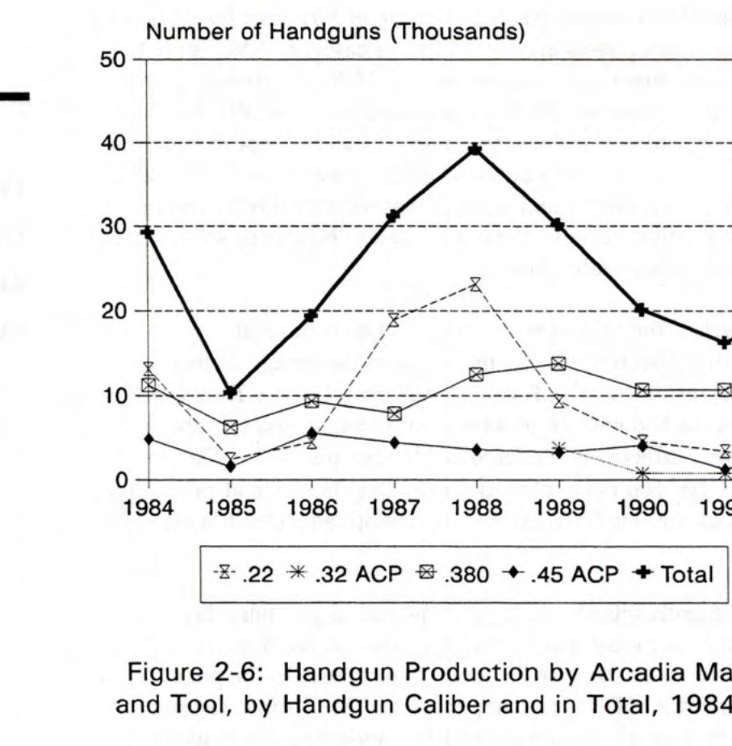

> **Figure 2-6: Handgun Production by Arcadia Machine and Tool, by Handgun Caliber and in Total, 1984–1992.**
> A line chart by caliber (.22, .32 ACP, .380, .45 ACP, and total). AMT's output is modest relative to the Jennings-family firms; the .380 ACP line dominates, reflecting the Backup pistol's role as the company's leading product.

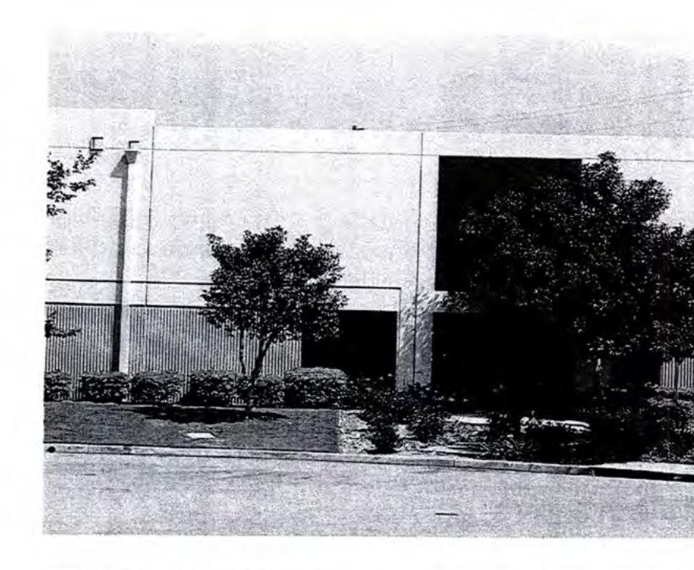

> **Figure 2-7:** The Arcadia Machine and Tool facility in Irwindale, CA *(photograph).*
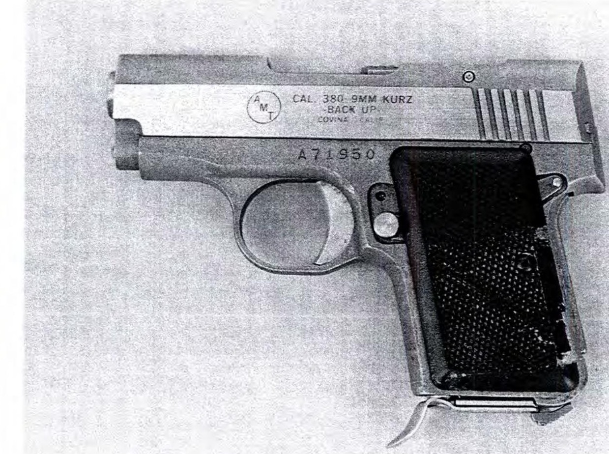

> **Figure 2-8:** The AMT Backup pistol *(photograph; shown actual size).*

#### Table 2-3: Arcadia Machine and Tool, 1992 Production Data

| Gun type and caliber | Number manufactured | Percent of company total |
|---|--:|--:|
| **Pistols** | | |
| .22 | 1,220 | 6 |
| .25 | 0 | — |
| .32 | 0 | — |
| .380 | 15,219 | 74 |
| 9mm | 355 | 1 |
| .45 | 3,136 | 15 |
| *Pistols total* | *19,930* | *96* |
| Revolvers | 0 | — |
| Rifles | 759 | 4 |
| Shotguns | 0 | — |
| **Total** | **20,689** | **100** |

#### Table 2-4: Arcadia Machine and Tool, 1994 Handgun Models and Suggested Prices

| Model | Caliber | Dealer price | Retail price | Markup (%) |
|---|---|--:|--:|--:|
| Backup | .380 ACP | $237 | $310 | 31 |
| Backup II | .380 ACP | $225 | $296 | 32 |
| Backup | .45 ACP | NA† | NA | NA |
| On Duty | .40 S&W, 9mm | $359 | $470 | 31 |
| On Duty | .45 ACP | $402 | $530 | 32 |
| Automag II | .22 Mag | $294 | $386 | 31 |
| Automag III | .30 Carbine | $343 | $460 | 34 |
| Automag IV | .45 WinMag | $514 | $680 | 32 |
| Automag V | .50 AE | $750 | $900 | 20 |
| Standard Government | .45 ACP | $359 | $476 | 33 |
| Hardballer | .45 ACP | $400 | $530 | 33 |
| Long Slide | .45 ACP | $434 | $576 | 33 |

\* Recent discount catalogs for dealers offered AMT's guns at up to 20 percent below list dealer price.
† Not available.

---

### Bryco Arms

> 380 Clinton St.
> Costa Mesa, CA 92626
> Telephone: 714/252-7621

> **Gun Tests on the Bryco 9mm Model 59:** "[W]e would stay well away from this one."

The company now known as Bryco Arms was exclusively in the .22-caliber handgun business until 1988 but has since diversified. By 1992, it produced more pistols in .380 ACP than any other caliber and more guns overall than any other Ring of Fire company. Bryco has recently moved, and is now immediately next to John Wayne Airport in Orange County.

Bryco's .25 ACP Model J-25 was described in *Gun Tests* as a "budget-priced, chromed auto that was very accurate despite rough slide movement. [It had] unreliable functioning due to poorly constructed magazine. Our rating: 'your call.'" Their .32 ACP pistol was considered more favorably by *Gun Tests* evaluators. It was "no more troublesome than many other small, inexpensive autos" to operate, and the reviewers "were pleasantly surprised to note that it digested hollowpoint ammunition reliably."

Bryco produces several .380 ACP pistols that vary in size and ammunition capacity. *Gun Tests* found the Model 48, a full-size pistol selling for "just over $100," to be difficult to operate. It jammed repeatedly; the safety was troublesome and the trigger so problematic "that our shooters developed blisters on their fingers." The magazine found the gun "just acceptable, primarily because of its low price."

Bryco's newest pistol, its Model 59 13-shot 9mm pistol, was released late in 1993. *Gun Tests* reviewers found a number of operational problems with this gun as well and concluded, "until the manufacturer figures out how to keep it from self-destructing, we would stay well away from this one."

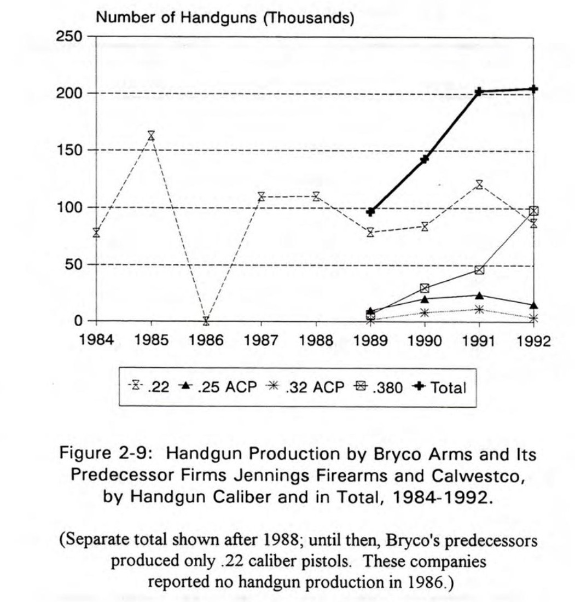

> **Figure 2-9: Handgun Production by Bryco Arms and Its Predecessor Firms Jennings Firearms and Calwestco, by Handgun Caliber and in Total, 1984–1992.**
> *(Separate total shown after 1988; until then, Bryco's predecessors produced only .22-caliber pistols. These companies reported no handgun production in 1986.)* A line chart in which .22 production dominates early, then .380 ACP surges after 1988 to become the largest single category by 1992, lifting total output above 200,000 guns.

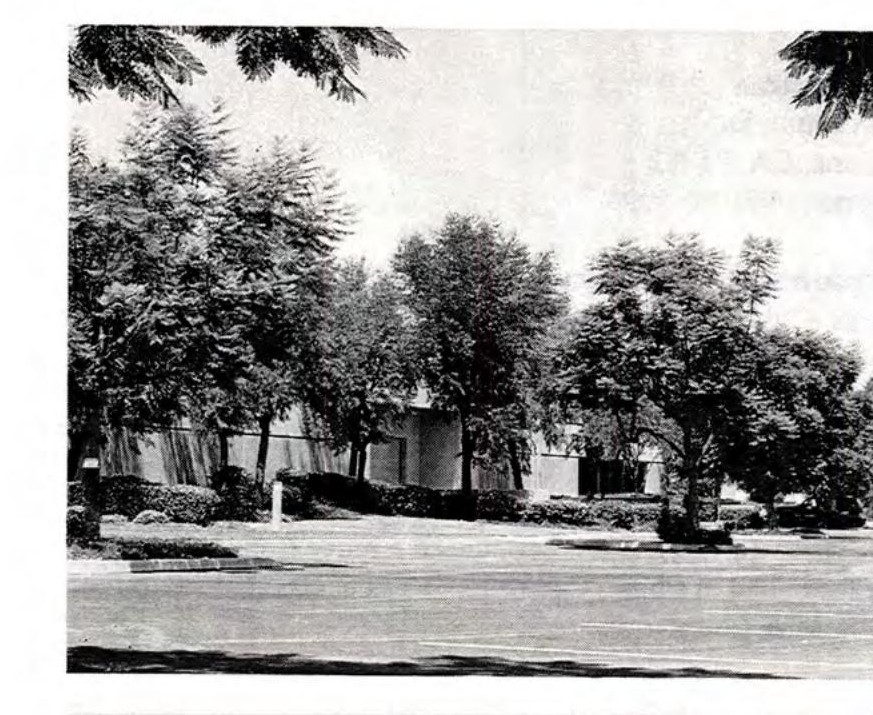

> **Figure 2-10:** The Bryco Arms facility in Costa Mesa, CA *(photograph).*
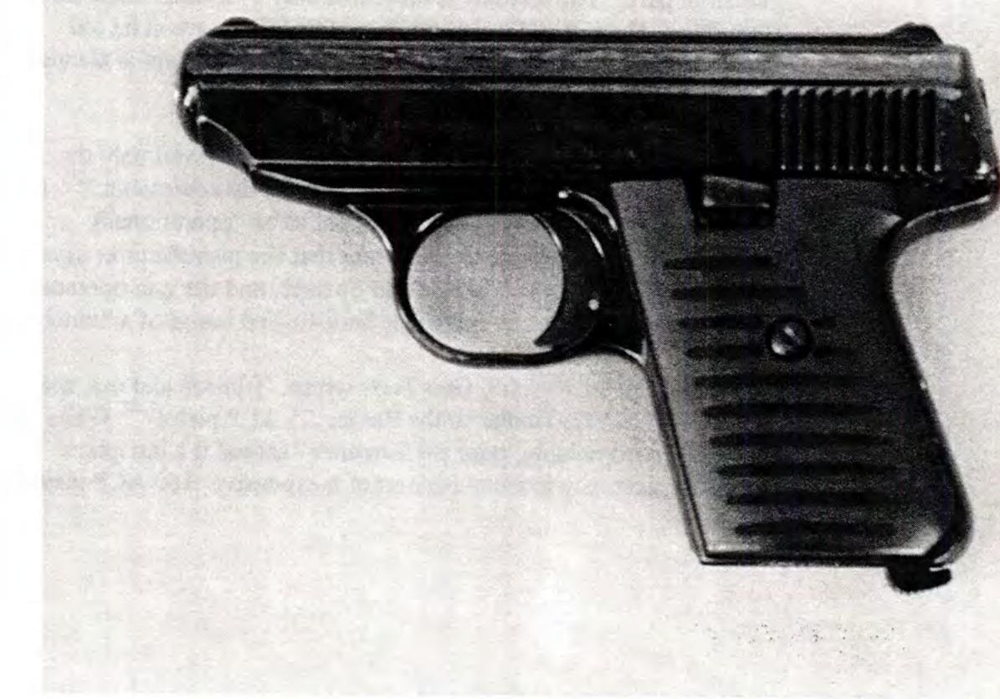

> **Figure 2-11:** The Jennings J-25 pistol, manufactured by Bryco Arms *(photograph; shown actual size).*

#### Table 2-5: Bryco Arms, 1992 Production Data

| Gun type and caliber | Number manufactured | Percent of company total |
|---|--:|--:|
| **Pistols** | | |
| .22 | 87,401 | 43 |
| .25 | 15,477 | 8 |
| .32 | 3,777 | 2 |
| .380 | 98,228 | 48 |
| 9mm | 0 | — |
| .45 | 0 | — |
| *Pistols total* | *204,883* | *100* |
| Revolvers | 0 | — |
| Rifles | 0 | — |
| Shotguns | 0 | — |
| **Total** | **204,883** | **100** |

#### Table 2-6: Bryco Arms, 1994 Handgun Models and Suggested Prices

| Model | Caliber | Dealer price | Retail price | Markup (%) |
|---|---|--:|--:|--:|
| J-22 | .22 LR | $50 | $75 | 50 |
| J-25 | .25 ACP | $57 | $90 | 58 |
| 38 | .22 LR, .32 ACP | $79 | $110 | 39 |
| 38 | .380 ACP | $89 | $130 | 46 |
| 48 | .22 LR, .32 ACP, .380 ACP | $99 | $139 | 40 |
| 59 | .380 ACP, 9mm, .40 S&W | NA† | NA | NA |

\* Prices are rounded to nearest dollar. Recent discount catalogs for dealers offered Bryco's guns at up to 7 percent below list dealer price.
† Not available.

---

### Davis Industries

> 11186 Venture Dr.
> Mira Loma, CA 91752
> Telephone: 909/360-5598

> **Gun Tests on the Davis .380 ACP P-380:** "[L]ast-place finish" for accuracy.

Davis Industries began life small as a derringer maker, but grew rapidly as it added .32 ACP and .380 ACP pistols to its product line. By 1992 it ranked second in volume among the Ring of Fire manufacturers, in a virtual tie with Lorcin Engineering. Like Bryco Arms, Davis makes more .380 ACP pistols than anything else. It has continued to do well; earlier this year *Shooting Industry,* a leading trade journal, described the company's progress to date as "explosive." In 1993, Davis announced a move from its 13,000-square-foot plant in Chino, California to a new 40,000-square-foot facility in Mira Loma.

The new plant is located near the intersection of the Pomona freeway and the Ontario freeway, just inside Riverside County. Davis is in the Empire Business Center, a new (largely yet to be constructed) industrial park. The building is identified only by a small decal on the front door. Currently, Davis' administrative offices are in its old facility in Chino. Consolidation into the Mira Loma plant is planned for later this year.

Of Davis' derringers, *Gun Tests* has apparently reviewed only the .38 caliber Big Bore. The gun's accuracy was "barely acceptable." *Gun Tests* found the company's .32 ACP pistol to be "operationally ... inconsistent," but "reliable to the extent that the manufacturer says it will be." The safety was difficult to operate, and the gun operated dependably only with one particular hard-to-find brand of ammunition.

Of Davis' .380 ACP pistol, *Gun Tests* wrote, "[i]nside and out, the Davis P-380 is very similar to the Raven .25 ACP pistol." While the gun functioned reliably, poor performance "earned it a last-place finish" for accuracy in a comparison of inexpensive .380 ACP pistols.

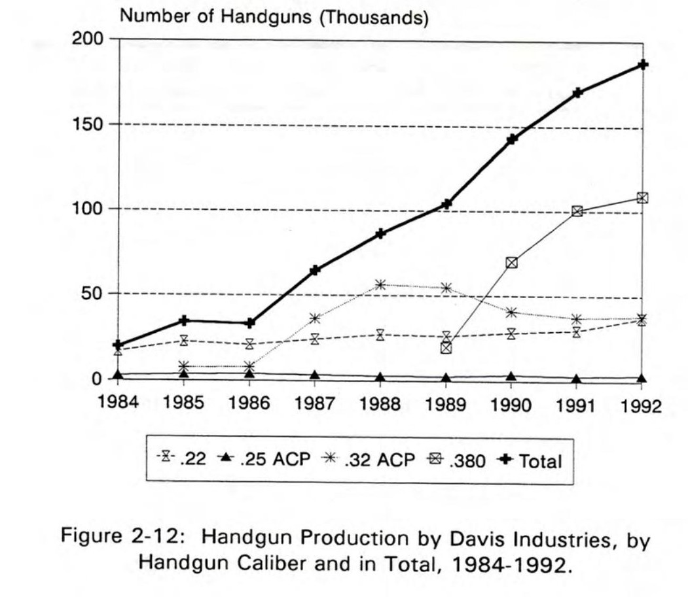

> **Figure 2-12: Handgun Production by Davis Industries, by Handgun Caliber and in Total, 1984–1992.**
> A line chart by caliber (.22, .25 ACP, .32 ACP, .380, total). Output climbs steeply through the early 1990s; the .380 ACP line rises fastest and accounts for most of the company's growth, with total production approaching 190,000 guns by 1992.

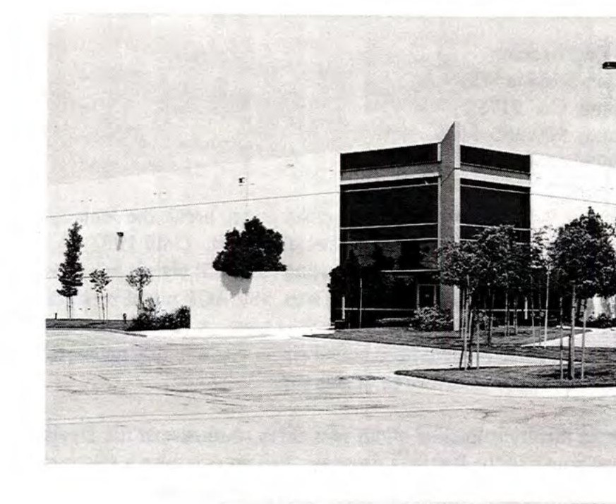

> **Figure 2-13:** The Davis Industries facility in Mira Loma, CA *(photograph).*

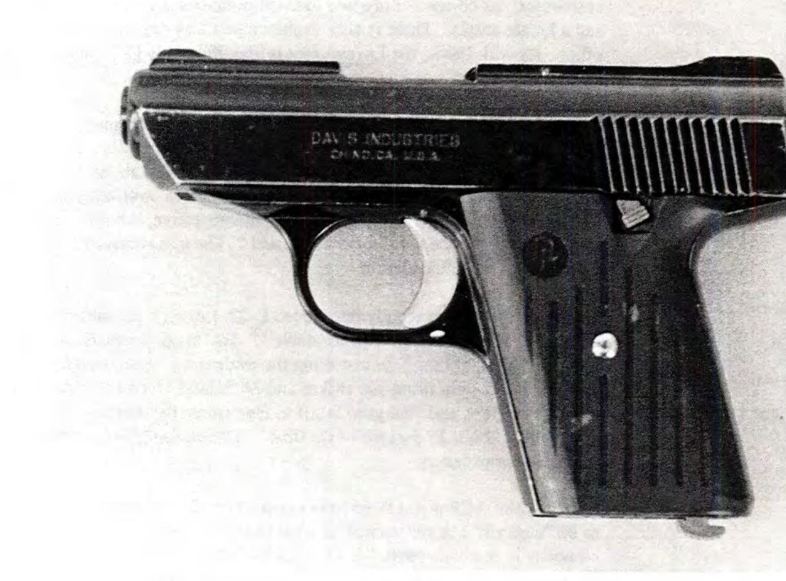

> **Figure 2-14:** A Davis Industries pistol *(photograph, shown actual size).* The original printed caption is too faint on the scanned page to transcribe; the slide engraving reads "Davis Industries, Chino, CA, U.S.A."

#### Table 2-7: Davis Industries, 1992 Production Data

| Gun type and caliber | Number manufactured | Percent of company total |
|---|--:|--:|
| **Pistols** | | |
| .22 | 37,114 | 20 |
| .25 | 3,532 | 2 |
| .32 | 38,126 | 20 |
| .380 | 109,007 | 58 |
| 9mm | 0 | — |
| .45 | 0 | — |
| *Pistols total* | *187,779* | *100* |
| Revolvers | 0 | — |
| Rifles | 0 | — |
| Shotguns | 0 | — |
| **Total** | **187,779** | **100** |

#### Table 2-8: Davis Industries, 1994 Handgun Models and Suggested Prices

| Model | Caliber | Dealer price | Retail price | Markup (%) |
|---|---|--:|--:|--:|
| P-32 | .32 ACP | $63 | $88 | 40 |
| P-380 | .380 ACP | $70 | $98 | 40 |
| D-Series (Derringer) | .22 LR, .22 WMR, .25 ACP, .32 ACP | $43 | $65 | 51 |
| Big Bore Series (Derringer) | .32 H&R Mag, .38 SP | $60 | $90 | 50 |

\* Recent discount catalogs for dealers offered Davis' guns at 10 to 12 percent below list dealer price.

---

### Lorcin Engineering

> 10427 San Sevaine Way – A
> Mira Loma, CA 91752
> Telephone: 909/360-1406 · FAX: 909/360-0623

> **Gun Tests on the Lorcin L-22:** "Unacceptable."

Lorcin Engineering is the company that set out to break the Jennings family's lock on the Saturday Night Special market. Until 1992, Lorcin was a one-gun company, producing .25 ACP pistols in ever-increasing numbers. That year it went into .380 ACP pistol production in a big way, and added a .32 ACP pistol as well. A .22-caliber pistol and a larger .380 ACP have been added since, and a highly promoted 9mm gun was released in March of this year.

The Lorcin facility is located about two miles southeast of the Davis plant, just south of the Pomona freeway. Lorcin occupies a relatively small space in one corner of a building otherwise devoted to service businesses. Its co-tenants are two medical practices, a sandwich shop, and a karate studio. There is also an abandoned *Los Angeles Times* office. As with Davis, the Lorcin plant is identified only by a small decal on the door.

In its *Gun Tests* evaluation, Lorcin's .25 ACP pistol "performed unreliably, either failing to chamber a round or overriding the top cartridge in the magazine with a resulting feeding failure about 20 percent of the time." After test firing, the evaluators concluded: "Accuracy from this type of pistol is seldom impressive, but this Lorcin's performance was worse than usual." The gun received a "Don't Buy" recommendation.

> **Gun Tests on the Lorcin L-380:** "Don't buy."

*Gun Tests* found the recently introduced L-22, Lorcin's .22 caliber pistol, to be categorically "Unacceptable." Its "handling qualities were mediocre, at best." In test firing the evaluators "experienced 20 misfires due to light firing-pin strikes and 36 failures to completely lock into battery, and [the gun] failed to feed truncated-nose ammunition about 25 percent of the time." The bottom line: a "do not buy" recommendation.

Lorcin's .380 ACP pistol fared little better. *Gun Tests* found the gun to be "basically a larger version of what has made money for the company in previous years." The gun "routinely failed to feed at least one or two rounds of hollowpoint ammunition per magazine, and ejection was marginal at best.... [W]e had a number of stove-pipe jams as a result." *Gun Tests* concluded that "the failures to feed a couple of rounds per magazine of hollowpoints defeats the purpose of a gun made for personal defense." This gun also received a "don't buy" recommendation, "despite its accuracy and low price."

In 1994 Lorcin introduced a 9mm pistol, the L-9MM. No *Gun Tests* evaluation is available.

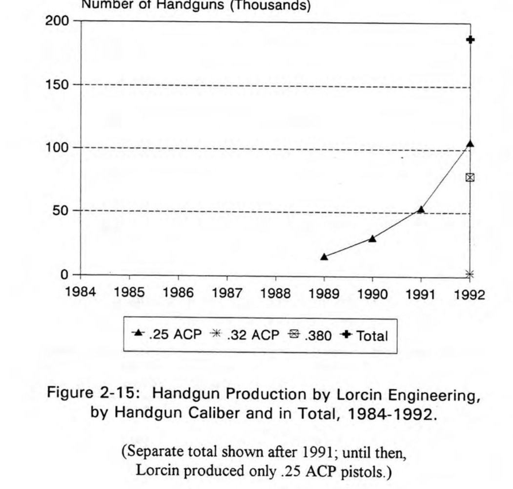

> **Figure 2-15: Handgun Production by Lorcin Engineering, by Handgun Caliber and in Total, 1984–1992.**
> *(Separate total shown after 1991; until then, Lorcin produced only .25 ACP pistols.)* A line chart showing .25 ACP production rising steadily, then a sharp 1992 jump as .380 ACP production begins, pushing total output near 188,000 guns.

#### Table 2-9: Lorcin Engineering, 1992 Production Data

| Gun type and caliber | Number manufactured | Percent of company total |
|---|--:|--:|
| **Pistols** | | |
| .22 | 0 | — |
| .25 | 105,901 | 56 |
| .32 | 2,910 | 2 |
| .380 | 78,950 | 42 |
| 9mm | 0 | — |
| .45 | 0 | — |
| *Pistols total* | *187,761* | *100* |
| Revolvers | 0 | — |
| Rifles | 0 | — |
| Shotguns | 0 | — |
| **Total** | **187,761** | **100** |

#### Table 2-10: Lorcin Engineering, 1994 Handgun Models and Suggested Prices

| Model | Caliber | Dealer price | Retail price |
|---|---|--:|--:|
| L-22 | .22 LR | NA† | $80 |
| L-25 | .25 ACP | NA | $80 |
| L-32 | .32 ACP | NA | $85 |
| L-380 | .380 ACP | NA | $95 |
| LHC-380 | .380 ACP | NA | NA |
| L-9MM | 9mm | NA | NA |

\* Prices rounded to nearest dollar. Lorcin did not provide suggested dealer prices for its guns. Recent discount catalogs for dealers offered Lorcin's guns at these prices: L-22, $44–$49; L-25, $34–$37; L-32, $52; L-380, $62–$63; LH-380, $90; L-9MM, $100.
† Not available.
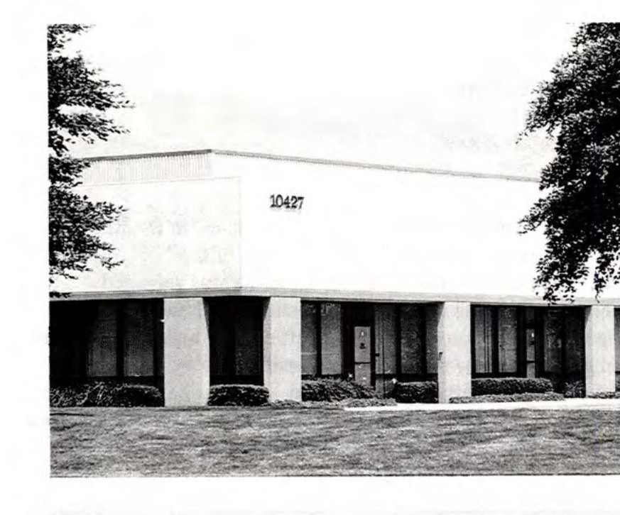

> **Figure 2-16:** The Lorcin Engineering facility in Mira Loma, CA *(photograph).*
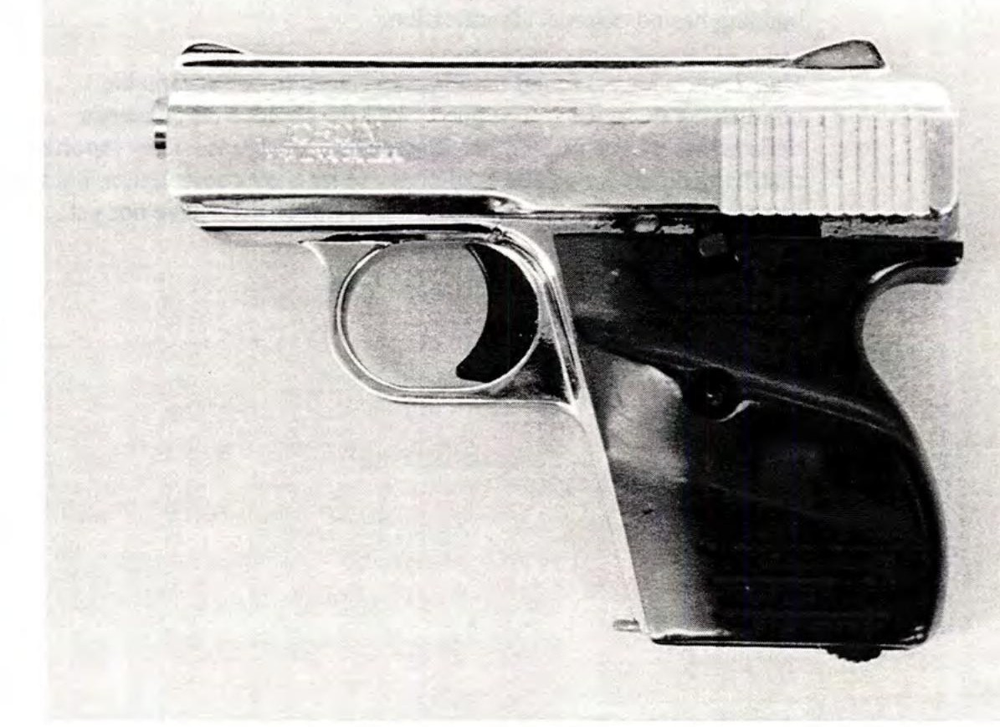

> **Figure 2-17:** The Lorcin Engineering L-25 pistol *(photograph; shown actual size).*

---

### Phoenix Arms

> 1420 South Archibald Ave.
> Ontario, CA 91761
> Telephone: 909/947-4843 · FAX: 909/947-6798

> **Gun Tests on the Phoenix Raven:** "[D]urability will be limited."

Phoenix Arms is both the newest and oldest company in the Ring of Fire group. It was born literally out of the ashes of the 1991 fire that put Raven Arms out of business. Raven's tooling was salvaged; George Jennings took the opportunity to retire; and Phoenix took up .25 ACP pistol production where Raven left off. Its main product, the old Raven gun with some minor improvements (notably a magazine-disconnect device), retains the Raven name. Phoenix has added larger .25 ACP and .22-caliber pistols to its product line but has not followed the larger companies into the medium-caliber market.

The Phoenix plant is located immediately next to Ontario International Airport in another new and largely unoccupied light industrial area. It is roughly five miles northwest of the Davis and Lorcin facilities. The building has no external identification.

*Gun Tests* reviewers found the Phoenix Raven to be "acceptable, considering the price." The gun lacked the obvious performance deficits that plague many other Ring of Fire handguns. They reported that "[i]ts durability will be limited due to its alloy construction, but for less than $75 that's to be expected." The newer guns have not yet been reviewed.

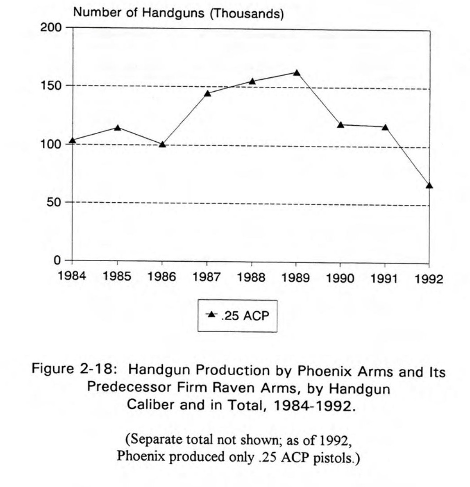

> **Figure 2-18: Handgun Production by Phoenix Arms and Its Predecessor Firm Raven Arms, by Handgun Caliber and in Total, 1984–1992.**
> *(Separate total not shown; as of 1992, Phoenix produced only .25 ACP pistols.)* A single-line chart of .25 ACP output, which approaches 70,000 guns in 1992 — the first year of Phoenix production following the Raven fire.

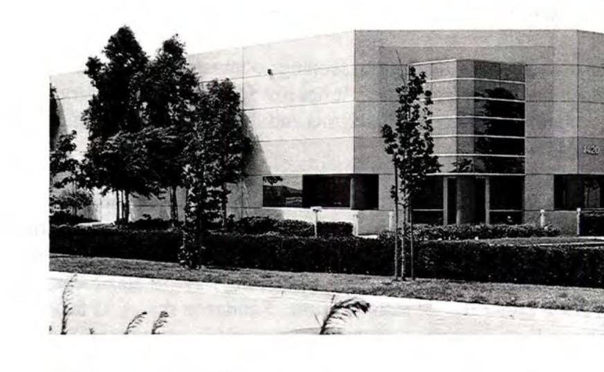

> **Figure 2-19:** The Phoenix Arms facility in Ontario, CA *(photograph).*
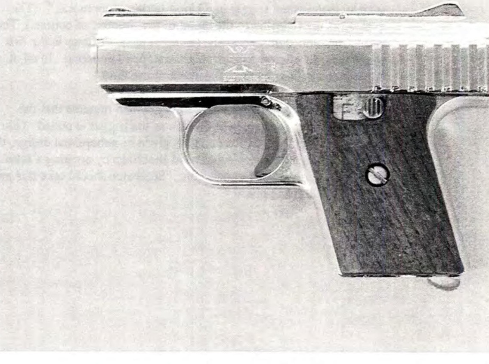

> **Figure 2-20:** The Raven P-25 pistol *(photograph; shown actual size).*

#### Table 2-11: Phoenix Arms, 1992 Production Data

| Gun type and caliber | Number manufactured | Percent of company total |
|---|--:|--:|
| **Pistols** | | |
| .22 | 0 | — |
| .25 | 67,824 | 100 |
| .32 | 0 | — |
| .380 | 0 | — |
| 9mm | 0 | — |
| .45 | 0 | — |
| *Pistols total* | *67,824* | *100* |
| Revolvers | 0 | — |
| Rifles | 0 | — |
| Shotguns | 0 | — |
| **Total** | **67,824** | **100** |

#### Table 2-12: Phoenix Arms, 1994 Handgun Models and Suggested Prices

| Model | Caliber | Dealer price | Retail price |
|---|---|--:|--:|
| Raven | .25 ACP | NA† | $79 |
| HP | .22 LR, .25 ACP | NA | $100 |

\* Prices rounded to nearest dollar. Phoenix did not provide suggested dealer prices for its guns. Recent discount catalogs for dealers offered Phoenix's guns at these prices: Raven, $34–$38; .22 LR HP, $68.
† Not available.

---

### Sundance Industries

> 25163 W. Avenue Stanford
> Valencia, CA 91355
> Telephone: 805/257-4807

> **Gun Tests on the Sundance BOA:** "[B]ack to the drawing board."

Sundance is an anomaly among the Jennings companies, in that it started small and has stayed small. It has not followed the industry into larger and more powerful handguns and does little marketing of those it does make.

The plant is located in a recently constructed business park directly across the Interstate 5 freeway from Magic Mountain amusement park. The building in which Sundance is located has multiple tenants, and the entrance to Sundance itself is through a side alleyway. A small sign on the door is the only external identification. Sundance shares its facility with Jennings Fine Turning.

Sundance produces two .25 ACP pistols, the A-25 and the BOA. Both models were examined by *Gun Tests* in 1993. Of the Model A-25, the evaluators found that its assets were not "enough to offset such an inconsistent trigger and blood-letting ergonomics." (The evaluators are referring to the blood of the shooter, of course.) The BOA "functioned unacceptably, failing to eject 17 times in the first 100 rounds and so often thereafter that we stopped counting. In all, it stove-piped approximately 20 percent of the time."

The BOA is equipped with a grip safety, which requires that the shooter squeeze the handle of the gun as the trigger is pulled. *Gun Tests* reviewers were concerned that, given its suboptimal design, the grip safety might increase unintended shootings by creating a false sense of security. Their conclusion: "Sundance should take this one back to the drawing board."

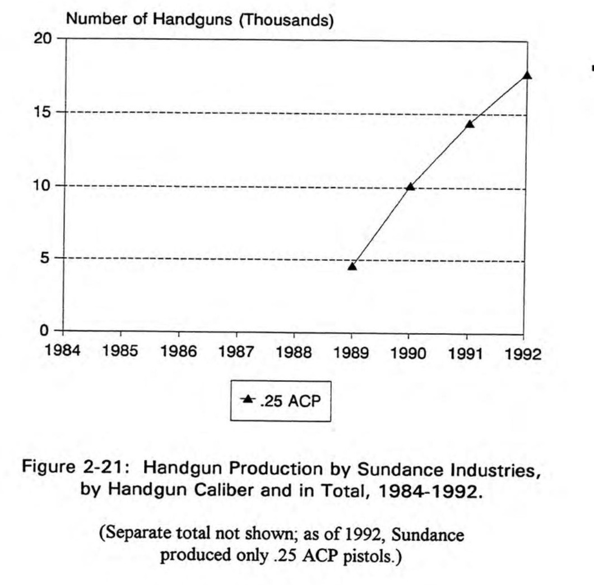

> **Figure 2-21: Handgun Production by Sundance Industries, by Handgun Caliber and in Total, 1984–1992.**
> *(Separate total not shown; as of 1992, Sundance produced only .25 ACP pistols.)* A single-line chart of .25 ACP output, peaking below 20,000 guns — the smallest of the Ring of Fire producers.

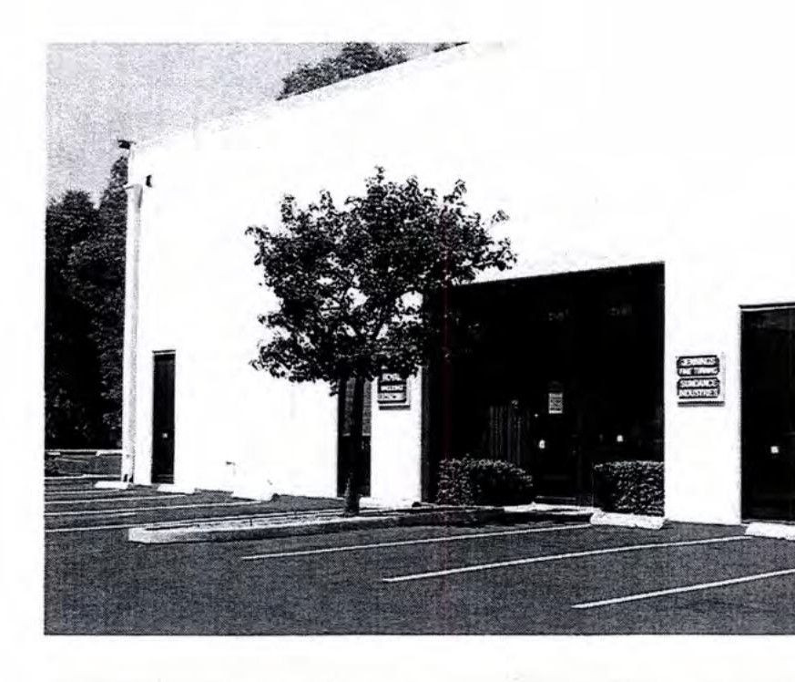

> **Figure 2-22:** The Sundance Industries facility in Valencia, CA *(photograph).*
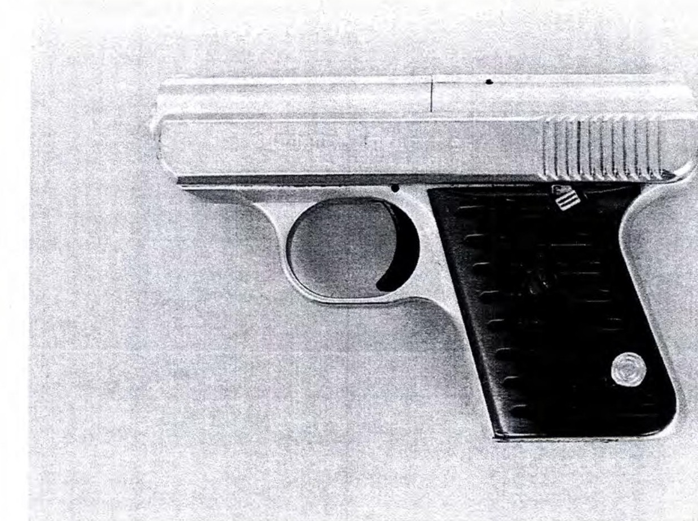

> **Figure 2-23:** The Sundance Industries A-25 pistol *(photograph; shown actual size).*

#### Table 2-13: Sundance Industries, 1992 Production Data

| Gun type and caliber | Number manufactured | Percent of company total |
|---|--:|--:|
| **Pistols** | | |
| .22 | 0 | — |
| .25 | 17,757 | 100 |
| .32 | 0 | — |
| .380 | 0 | — |
| 9mm | 0 | — |
| .45 | 0 | — |
| *Pistols total* | *17,757* | *100* |
| Revolvers | 0 | — |
| Rifles | 0 | — |
| Shotguns | 0 | — |
| **Total** | **17,757** | **100** |

#### Table 2-14: Sundance Industries, 1994 Handgun Models and Suggested Prices

| Model | Caliber | Dealer price | Retail price | Markup (%) |
|---|---|--:|--:|--:|
| BOA | .25 ACP | $50 | $95 | 90 |
| A-25 | .25 ACP | $45 | $80 | 89 |
| Point Blank (Derringer) | .22 LR | $55 | $99 | 80 |

\* Recent discount catalogs for dealers offered Sundance's guns at 10 to 25 percent below list dealer price.
---

# How Ring of Fire Companies Sell Their Guns

Gun experts' opinions notwithstanding, Ring of Fire manufacturers promote their handguns primarily as a means of personal and household protection. Economic themes are also prominent; low cost is stressed in ads for consumers and high profit margin in ads for dealers.

Many themes that are prominent in the advertising of other major handgun makers are notably absent here. Excepting only AMT, Ring of Fire companies make no appeals to the use of these guns for sport shooting, hunting, or the other activities that can be considered beneficial uses of handguns.

The descriptions that follow are based on a review of the Ring of Fire manufacturers' catalogs and promotional materials for 1993 and 1994. In addition, all issues of seven firearms magazines were examined for the year ended June, 1994. Two of these magazines, *American Firearms Industry* and *Shooting Industry,* are trade publications targeted at retail gun dealers. The other five are directed at gun consumers: *American Handgunner, American Rifleman, Guns and Ammo, Shooting Times,* and *Women & Guns.*

No ads from any of the Ring of Fire manufacturers appeared in *American Rifleman,* published by the National Rifle Association. During earlier periods of national concern about cheap, poor-quality handguns, the NRA made much of their policy not to accept advertising for these guns. Perhaps that policy has been quietly continued.

### Arcadia Machine & Tool

> **"THE SMALLEST .45 ACP PISTOL EVER BUILT!"** — AMT

Since January 1994, AMT has been advertising its new Automag V, designed around the .50 Action Express cartridge. This extremely powerful handgun is shown in company promotional materials and magazine ads being used to hunt a Tyrannosaurus. It is described as having "AWESOME STOPPING POWER!"

Monthly ads in *Women & Guns* advertise the much smaller .380 ACP Backup pistol. Their major emphasis is the gun's easy concealability; the ads emphasize that this pistol "Fits Pocket or Purse," and a photograph shows the gun fitting entirely within the palm of a hand. Although the pistol is promoted as useful for law enforcement personnel, only *Women & Guns* carries ads for it.

Advertising for the company's new .45 ACP pistol has just begun. The June 1994 issue of *Shooting Times* carries an ad billing the gun as "THE SMALLEST .45 ACP PISTOL EVER BUILT!" Comparison photographs in the ad show that the new pistol is only slightly larger (by 3/4 inch in length) than AMT's .380 ACP Backup model.

### Bryco Arms

*American Firearms Industry* and *Shooting Industry* frequently carry full-page ads for Bryco's pistols, all sold under the brand name Jennings Firearms. These rather plain ads, almost in tombstone style, display simple silhouette photographs of the guns. Their text stresses the guns' low price: "Simply the Best Value;" "...best affordable handguns in the industry;" "BEST VALUE IN POCKET PISTOLS." Consumer magazines carry smaller versions of the same ads. Most ads prominently feature the trademark of Jennings Firearms — the silhouette of a heavily armed pirate.

### Davis Industries

> **"Your Personal Right to a Davis Self-Defense..."** — Davis Industries

Davis has easily the most extensive and creative advertising campaign of any of the Ring of Fire manufacturers. Its ads appeal to the customer's patriotism and stress Davis' own political activism. The guns themselves are promoted exclusively for use in personal self-defense.

The 1994 Davis catalog, titled "DEFENDING PRECIOUS POSSESSIONS," displays the company's handguns surrounded by jewelry and the Bill of Rights. The text of the catalog begins:

> We all have things that are precious to us. Things that are worth protecting.
>
> Unfortunately, today, our possessions, our rights, even our very lives seem under assault as never before.
>
> When you decide to purchase arms to protect your home, your loved ones, and yourself, remember that Davis Industries is a 100% American-owned and operated company that supports everyone's individual rights to keep and bear arms.

Ads directed at gun dealers mingle patriotism with economics. One common full-page ad is headed "Words From Our Sponsors..." Below the usual photograph of handguns, jewelry, and the Bill of Rights are ostensibly pro-gun quotations from Patrick Henry, George Mason, James Madison, Thomas Jefferson, and George Washington ("When firearms go, all goes — we need them every hour.") The accompanying text begins:

> Here at Davis Industries we stand solidly (sic) in favor of every citizen's right to their own self defense. But rights are of little use if the people lack the means to exercise them. This is why all our firearms are made to be affordable, yet at the same time reliable and accurate. We never forget that having the right tools for the job includes being able to afford those tools!

A similar ad, the front cover of the October 1993 issue of *Shooting Industry,* is titled "Defend Your Bottom Line."

Ads directed at consumers emphasize personal defense. An ad in the June 1994 issue of *Shooting Times* is headed, "Your Personal Right to a Davis Self-Defense..." The ad poses the question, "What Price Freedom[?]" and responds that Davis' pistols are "reliable, accurate, and affordable."

Davis is particularly active in advertising to women, with full-page ads in most issues of *Women & Guns.* With the trademark guns/jewelry/Bill of Rights photography, recent ads have been headed "Two Points for the Defense" (an ad for two .38-caliber derringers) and "Davis Protects Day and Night." The ads emphasize the small size of Davis' guns, their accuracy (when fired by experienced professionals, as it happens) and their low price: "so you're able to afford to defend yourself!"

### Lorcin Engineering

> **"3 Little Ladies That Get the Job Done."** — Lorcin Engineering

Lorcin competes primarily on economics. The company logo displays its name in front of a map of the globe and the slogan "THE WORLD'S MOST AFFORDABLE HANDGUNS." Lorcin is pushing hard to sell its new 9mm, 13-shot pistol. Most of its consumer and dealer ads are for this gun, advertised as "AFFORDABLE FIREPOWER," as "100% American made," and as "Available at Wholesalers Everywhere." Another ad for dealers, which displays the company's entire product line, is headed "HIGH CAPACITY PROFITS on HIGH-CAPACITY HANDGUNS."

A full-page ad in recent issues of *Women & Guns* reprints the company's catalog photograph of its three 9-shot .22-caliber pistols under the heading "3 Little Ladies That Get The Job Done." The pistols, one of which comes in a chrome finish with pink grips, are described as "Favored by Most, Affordable to All, 100% American made."

The outside back cover of the December 1993 *American Firearms Industry* contains a remarkable full-page ad for Lorcin's .22 caliber pistol. The gun, along with 10 rounds of ammunition, is lying on top of an issue of the *Wall Street Journal.* The paper in turn lies on a business desk, surrounded by a pen set, a chronometer, and a soberly black pair of reading glasses. The ad is headed "BUSINESS DECISIONS ARE BASED ON RESEARCH." The text adds, "[and] research will show that the new Lorcin .22 Long Rifle Pocket Pistol will outsell any others by a wide margin. Its 3-dot sights, 9-shot mag, and Euro design costs [sic] no more than the others but add considerable dollars to your bottom line."

The company chose the *Wall Street Journal* issue of 28 February 1992 for this ad. The right-hand column is folded under; this column and two entire interior pages of the paper contain the Alix Freedman article on Lorcin and the other Ring of Fire companies discussed earlier.

### Phoenix Arms

> **"PROTECTION, PEACE OF MIND AND SELF-CONFIDENCE UNDER $100."** — Phoenix Arms

Ads from Phoenix are small, black-and-white, and relatively plain. The .25 ACP model Raven, described in Phoenix's 1993 promotional materials as "Arguably the most popular .25 caliber pistol on the market today," is billed in many ads as "the .25 auto that stands out from the rest." This is a hard case to make, since so many other Jennings family pistols are based closely on the original Raven .25. These ads stress the low price of the gun and its small size. Ads for Phoenix's new high-capacity pistols tout them as "PROTECTION, PEACE OF MIND AND SELF-CONFIDENCE UNDER $100."

### Sundance Industries

Sundance has adopted a Western theme. Its catalog is printed in trendy Southwestern colors; the cover illustration shows a cowboy (apparently unarmed) riding off into the hills. The corporate logo is a 10-gallon hat resting on a pair of cowboy boots and a gun belt. The one gun in the logo is a stylized revolver, a gun Sundance does not make.

The company catalog states that it "takes great pride in knowing that we produce the finest quality pocket pistol in America." Its "pistols are competitively priced and have an excellent profit margin." It promotes its BOA model as "the only inexpensive pistol made in America with a grip safety." Sundance still distributes the catalog issued in 1992, and a year's worth of gun magazines contained no advertisements.
# Ring of Fire Guns and Crime

The cheap, easily concealable pistols produced by the Ring of Fire firms are the 1990s incarnation of the Saturday Night Specials of the 1960s and '70s. Thus, general information on a criminal preference for cheap, easily concealable, small-caliber handguns is relevant here.

In the 1970s, BATF conducted large-scale studies of handguns confiscated by the police. The first, Project Identification, described more than 10,000 handguns taken during 1973–1975. Of these guns, 56 percent were believed to be worth less than $50, 71 percent had a barrel length of 3 inches or less, and 61 percent were .32 caliber or smaller. Forty-five percent of the confiscated guns had all three of these characteristics and were classifiable as Saturday Night Specials.

This study was criticized because BATF had not distinguished guns actually used in crime from those confiscated for other reasons. However, as described by criminologist James Wright and colleagues, careful re-analysis yielded substantially similar results.

In a follow-up multi-city study called Project CUE (Concentrated Urban Enforcement), BATF did associate gun characteristics with specific violent felonies. Of more than 22,000 handguns confiscated, 21 percent were involved in homicide, robbery, rape, or assault. Fifty-one percent of these known crime guns were .32 caliber or smaller, and 72 percent had a barrel length of 3 inches or less.

> **In 1991–1993, 62% of crime guns traced by BATF came from a Jennings-related company.**

New data allow us to identify the specific role of Ring of Fire guns in crime. The conclusion is inescapable: Ring of Fire manufacturers supply today's weapons of choice for criminal use. Their guns are involved in many thousands of crimes each year.

The *Washington Post* reported in January 1994 that of all 21,744 guns "seized at crime scenes and traced" by BATF during 1991–1993, a remarkable 62 percent — 13,559 handguns — were produced by a "Jennings-related company." According to ABC television's *Day One*, in 1994 the Lorcin .380 ACP is the single firearm most frequently submitted to BATF for tracing.

The particular tragedy of Ring of Fire handguns is that they are special favorites of young people. Stephen Teret of The Johns Hopkins University calls such weapons "starter set" guns. One New York high school student, an illicit gun dealer who specialized in guns from the Jennings family companies, told reporter Alix Freedman, "Here where I live, every young kid has a .22 or a .25. It's like their first Pampers."

In California, law enforcement agencies confiscate tens of thousands of handguns each year. Ring of Fire pistols make up an ever-increasing share of these guns, as shown in Table 4-1. By 1993, Ring of Fire manufacturers produced 8 of the 10 most frequently confiscated handguns in California.

Local data from around the country tell the same story. According to Freedman's *Wall Street Journal* article, police in Houston confiscated nearly 1,000 guns used in crimes in 1991; the Raven .25 ACP, the Davis .380 ACP, and the Davis .32 ACP pistols ranked as the top three guns. In Cleveland that year, police confiscated more than 2,000 handguns; the Raven .25 ACP ranked second.

In Milwaukee County, Wisconsin, the Raven pistol has ranked first among all brands of handguns destroyed by the police department since at least 1991. By 1993, Davis Industries ranked second. More than half of all handguns destroyed by Milwaukee County law enforcement agencies in 1993 came from Ring of Fire manufacturers. Ironically, the commercial success of individual Ring of Fire companies can be reflected in Milwaukee's data. Davis Industries, for example, went from 79 guns destroyed in 1991, to 116 in 1992, to 270 in 1993.

And Raven Arms ranked among the top 10 manufacturers of handguns used to murder law enforcement officers in the 1980s. This is particularly remarkable in view of the fact that Raven produced only a .25 ACP pistol. Wounds from such "mouse guns" are less likely to be lethal than are wounds from more powerful handguns. It is probable that if information were available on both homicides and non-fatal shootings, Raven's ranking — and that of other Ring of Fire manufacturers — would be substantially higher.

#### Table 4-1: The Ten Handguns Most Frequently Confiscated by Law Enforcement Agencies in California, 1991–1993

Ring of Fire handguns are shown in *italics*.

| Rank | 1991 | 1992 | 1993 |
|---:|---|---|---|
| 1 | *Raven MP25* | *Raven MP25* | *Davis P-380* |
| 2 | *Bryco J-22* | *Davis P-380* | *Raven MP25* |
| 3 | *Davis P-380* | *Bryco J-22* | *Lorcin L-380* |
| 4 | *Raven P25* | *Raven P25* | *Bryco J-22* |
| 5 | *Davis P-32* | *Davis P-32* | *Raven P25* |
| 6 | Beretta 950BS | Smith & Wesson 36 | *Lorcin L-25* |
| 7 | Smith & Wesson 36 | Beretta 950BS | *Davis P-32* |
| 8 | Beretta 92F | *Lorcin L-25* | *Phoenix Raven* |
| 9 | Ruger P85 | *Bryco 38* | Beretta 950BS |
| 10 | Ruger Security Six | Ruger P85 | Beretta 92FS |

These reports certainly show that guns produced by Ring of Fire manufacturers play a major role in firearm violence. They cannot prove, though they certainly suggest, that Ring of Fire handguns are actually weapons of choice for criminal use. To do this, it must be shown that Ring of Fire handguns are used in crime not just frequently, but *disproportionately* — more frequently even than would be predicted from the large number of Ring of Fire guns in circulation.

The weapon-of-choice question is an important factor in determining how policymakers view Ring of Fire handguns. For example, when ABC's *Day One* reporter confronted Lorcin's Jim Waldorf with the fact that his company's .380 ACP pistol was traced more frequently than any other handgun in early 1994, Waldorf shrugged him off, noting that Lorcin had more than half of all .380 ACP pistol sales in the United States. Waldorf's implication presumably is that the Lorcin gun's prominence in the BATF tracing data is no more than should be expected, given the large number of these guns Lorcin has made.

As this anecdote and the earlier local area studies indicate, one common method for estimating and comparing the frequency with which different guns are involved in crime is to use BATF records of requests they receive from local law enforcement agencies to trace particular firearms. To trace a gun means to identify its chain of ownership beginning at the point of manufacture. While there are exceptions, this situation nearly always arises in the course of a criminal investigation. One recent example is BATF's determination that the Taurus .38 special revolver used to assassinate Mexico's presidential candidate Luis Donaldo Colosio was originally sold in 1977 by a San Francisco gun shop to a Bay Area security executive.

BATF has produced a special tabulation of all handguns for which tracing requests were submitted from September 1989 through September 1991, for each of the top 25 manufacturers in their tracing data. Importantly, this tabulation was limited to requests regarding handguns that had been manufactured on or after 1 January 1987. With this key refinement, it is possible to compare the number of traced guns made by a particular manufacturer to the total number of guns produced by that manufacturer that might have been traced.

These data are displayed in Table 4-2, in which the Ring of Fire manufacturers are compared with the Gun Valley firms Smith & Wesson, Ruger, and Colt. Nearly 6,300 Ring of Fire handguns were traced by BATF's National Tracing Center during the two-year study period. Guns from the Gun Valley manufacturers were involved in only 4,307 traces, a decrease of 32 percent, although these manufacturers had produced more than twice as many handguns since the beginning of 1987.

> **BATF tracing data suggest that Ring of Fire guns are 3.4 times more likely to be used in crime than are Gun Valley guns.**

#### Table 4-2: Number of Handgun Tracing Requests Submitted to BATF, 1989–1991, and Number of Handguns Produced, by Manufacturer, 1987–1991

| Manufacturer | Guns Traced (Sept 1989–Sept 1991) | Guns Manufactured (1987–Mid-1991) |
|---|---:|---:|
| **Ring of Fire** | | |
| AMT | 225 | 129,551 |
| Bryco | 1,083 | 560,572 |
| Davis | 2,256 | 483,870 |
| Lorcin | 217 | 72,656 |
| Raven | 2,518 | 640,350 |
| **Total** | **6,299** | **1,886,999** |
| **Gun Valley** | | |
| Colt | 771 | 546,825 |
| Smith & Wesson | 2,263 | 2,320,833 |
| Sturm Ruger | 1,273 | 1,462,825 |
| **Total** | **4,307** | **4,330,483** |

<!--CHART table-4-2-->

This large and important difference can be summarized in a standard public-health measure of comparative risk called an odds ratio. In this case, the odds that a Ring of Fire handgun will be traced (the number of Ring of Fire guns traced, divided by the number of Ring of Fire guns not traced) are divided by the odds that a Gun Valley handgun will be traced (the number of Gun Valley guns traced, divided by the number of Gun Valley guns not traced).

By this measure, handguns produced by the Ring of Fire manufacturers are 3.4 times as likely as guns from Gun Valley to be traced by BATF. Handguns from the Ring of Fire manufacturers are *disproportionately* involved in crime. They truly are weapons of choice for criminal use.

This overall conclusion is reinforced by the findings of a new study of the risk that specific guns would be used in homicides of law enforcement officers. The single gun with the greatest number of police homicides per number of guns in circulation was the .32 caliber pistol. As of 1992, nearly 90 percent of these guns were produced by Ring of Fire manufacturers.

> **The Ring of Fire manufacturers' crimes-to-jobs ratio is 275 gun crimes per job provided per year.**

The frequency of crime associated with Ring of Fire handguns can also be estimated in a nontraditional way that captures both risks and benefits associated with these guns. This might be called the crimes-to-jobs ratio. On the jobs side of the balance, Jim Waldorf of Lorcin Engineering stated in a letter to his suppliers that the five Jennings-related companies and their suppliers employed 2,100 people in early 1993. As for crimes, the Justice Department estimates that there were 931,000 handgun crimes in 1992, and BATF tracing data establish that 62 percent of all guns submitted for tracing by law enforcement come from one of the Jennings-related manufacturers. For rough estimation purposes, we can assume that a similar percentage of all handgun crimes involve guns made by these companies.

On this basis, in 1992 there were approximately 577,000 crimes committed with a gun from a Jennings-related company. This amounts to 275 gun crimes committed each year, somewhere in the United States, for each of the 2,100 persons employed directly or indirectly by the Jennings-related companies — more than one gun crime per employee per working day.
# How They Get Away with It

The sad fact is that the handgun manufacturing activities of the Ring of Fire companies are possible because the citizens of California and the United States, acting through their elected representatives and courts, have made it possible.

This section begins with a review of those actions which have created a protected niche for the Saturday Night Special industry in the United States and particularly in California. Not all the news is bad, however; several policies can serve as models for further action at the state and federal levels.

The modern epidemic of handgun violence began in the 1960s. Concern focused in particular on small, inexpensive, imported handguns (dubbed Saturday Night Specials by a Detroit police captain). These handguns were a special target of the Gun Control Act of 1968, the first major firearms legislation to be seriously considered by Congress since the 1930s.

This legislation banned the importation of firearms that were determined not to be "suitable for sporting purposes." The particulars of that definition were left to the Bureau of Alcohol, Tobacco and Firearms, which developed the factoring criteria discussed earlier. The criteria have changed little since their original development and not at all since 1977.

> **Saturday Night Special makers are legally protected from competition and liability.**

These factoring criteria set minimum size and safety specifications for imported pistols and revolvers. Firearms that meet the minimum requirements must also pass an evaluation of an array of individual design and materials characteristics. Many of these standards concern safety features intended to prevent unintended shootings. The General Accounting Office, the investigative arm of Congress, has concluded that nearly a third of all such shootings could be prevented if these safety features were required on all guns. The text of the current factoring criteria rating sheet is given in Table 5-1.

The history of the passage of the Gun Control Act of 1968 makes it clear that the intent of Congress was to eliminate from circulation the small-caliber, easily concealable, poorly made handguns that were believed to be disproportionately involved in crime. At the time, most — but not all — of these handguns were imported.

Firearms manufactured in the United States were specifically exempted from the requirements imposed by the factoring criteria. The effect was to create a protected industry in the United States geared to produce small, poorly made, easily concealable handguns. Many of these and other domestically manufactured handguns did not even meet the minimum safety requirements. By the mid-1970s, BATF estimated that over half of all handguns produced in the United States for civilian use could not legally have been imported.

As initially enacted, the importation restrictions in the Gun Control Act applied only to the importation of complete handguns. It remained possible for some years to import the parts for handguns which could not have been imported whole, assemble them here, and sell them legally. Several overseas manufacturers of such guns established subsidiary companies for the purpose of assembling and marketing them in this country. By 1981, there were four United States firms engaged in the business of assembling handguns from imported parts: Beretta USA in Maryland and R.G. Industries, Excam, and FIE Corporation, all in Florida. The aggregate output of these companies was reported to be 336,000 guns in 1981; the largest single firm, R.G. Industries, was the fifth largest producer of handguns in the United States.

#### Table 5-1: Factoring Criteria Applied by BATF to Handguns Proposed for Importation

Points are awarded for each individual characteristic as appropriate, and totaled. The minimum qualifying score is **45 for revolvers** and **75 for pistols**.

**REVOLVER**

*Prerequisites:* (1) Must pass safety test.\* (2) Must have overall frame length (with conventional grips, not diagonal) of 4½″ minimum. (3) Must have a barrel length of at least 3″.

| Individual Characteristic | Point Value |
|---|---:|
| **Barrel Length** (muzzle to cylinder face) | |
| &nbsp;&nbsp;Less than 4″ | 0 |
| &nbsp;&nbsp;For each ¼″ over 4″ | ½ |
| **Frame Construction** | |
| &nbsp;&nbsp;Investment cast or forged steel | 15 |
| &nbsp;&nbsp;Investment cast or forged HTS alloy | 20 |
| **Weapon Weight** (unloaded) | |
| &nbsp;&nbsp;Per ounce | 1 |
| **Caliber** | |
| &nbsp;&nbsp;.22 short to .25 ACP | 0 |
| &nbsp;&nbsp;.22 LR and .30 to .38 S&W | 3 |
| &nbsp;&nbsp;.38 special | 4 |
| &nbsp;&nbsp;.357 Mag and over | 5 |
| **Miscellaneous Equipment** | |
| &nbsp;&nbsp;Adjustable target sights (drift or click) | 5 |
| &nbsp;&nbsp;Target grips | 5 |
| &nbsp;&nbsp;Target hammer and target trigger | 5 |

\* *Safety Test:* A Double Action Revolver must have a safety feature which automatically (or in a Single Action Revolver by manual operation) causes the hammer to retract to a point where the firing pin does not rest upon the primer of the cartridge. The safety device must withstand the impact of a weight equal to the weight of the revolver dropping from a distance of 36″ in a line parallel to the barrel upon the rear of the hammer spur, a total of 5 times.

**PISTOL**

*Prerequisites:* (1) The pistol must have a positive manually operated safety device. (2) The combined length and height must not be less than 10″, with the height (right-angle measurement to barrel without magazine or extension) being at least 4″ and the length being at least 6″.

| Individual Characteristic | Point Value |
|---|---:|
| **Overall Length** | |
| &nbsp;&nbsp;For each ¼″ over 6″ | 1 |
| **Frame Construction** | |
| &nbsp;&nbsp;Investment cast or forged steel | 15 |
| &nbsp;&nbsp;Investment cast or forged HTS alloy | 20 |
| **Weapon Weight w/Magazine** (unloaded) | |
| &nbsp;&nbsp;Per ounce | 1 |
| **Caliber** | |
| &nbsp;&nbsp;.22 short and .25 AUTO | 0 |
| &nbsp;&nbsp;.22 LR and 7.65mm to .380 AUTO | 3 |
| &nbsp;&nbsp;9mm Parabellum and over | 10 |
| **Safety Features** | |
| &nbsp;&nbsp;Locked breech mechanism | 5 |
| &nbsp;&nbsp;Loaded chamber indicator | 5 |
| &nbsp;&nbsp;Grip safety | 3 |
| &nbsp;&nbsp;Magazine safety | 5 |
| &nbsp;&nbsp;Firing pin block or lock | 10 |
| **Miscellaneous Equipment** | |
| &nbsp;&nbsp;External hammer | 2 |
| &nbsp;&nbsp;Double action | 10 |
| &nbsp;&nbsp;Drift adjustable target sight | 5 |
| &nbsp;&nbsp;Click adjustable target sight | 10 |
| &nbsp;&nbsp;Target grips | 5 |
| &nbsp;&nbsp;Target trigger | 2 |

The imported-parts loophole was later closed, but to this day neither the factoring criteria nor any comparable set of design and performance standards has been imposed on handguns made in this country. Congress has not only declined to take action itself, but has prohibited regulatory agencies like BATF and the Consumer Products Safety Commission from intervening. It is no exaggeration to say that the Saturday Night Special industry in the United States flourishes in part as a direct result of conscious, deliberate, and repeated actions by Congress.

Since the early 1980s, product liability litigation has attempted to obtain compensation for victims of Saturday Night Special injuries and simultaneously to create disincentives for the continued production of these handguns. These lawsuits evolved from earlier successful firearms liability cases in which courts found that the guns involved had a specific design defect, such as an absent safety device, that resulted in an unintended shooting.

In the successful cases, injured parties were able to establish what is known as strict liability on the part of firearms manufacturers. Strict liability is defined in *Black's Law Dictionary* as "a concept applied by the court in product liability cases in which the seller is liable for any and all defective or hazardous products which unduly threaten a consumer's personal safety." The undue nature of the threat is critical here. The theory of strict liability holds that if a manufacturer produces a product that by its very nature or design is unreasonably hazardous, the product is defective and the manufacturer is liable for any injuries that result from the unreasonable hazard. This is true even if due care is used in actually producing the product, and if it is made exactly as intended.

Strict liability has been used to achieve many important advances in public health and safety. One early example is the 1967 case of *LaGorda v Kroger Co.*, which arose when a child was burned after his jacket caught fire. The jacket was made to industry standards and met all the requirements of the Federal Flammable Fabrics Act. But the evidence established that for only a few cents the manufacturer could have treated its jacket with a flame retardant. The court found that "the basic design of a product, perfectly manufactured, is defective if it results in an unreasonably dangerous product...."

Following this argument, the new handgun lawsuits put forward the idea that the basic design of Saturday Night Specials made them defective as a class of firearms, distinguishable in some manner from other handguns. The distinction, plaintiffs argued, lay in the finding that Saturday Night Specials posed greater risks to their users and society in general and offered fewer benefits than did other handguns. This argument relies on a legal doctrine called the risk-utility test, applied as follows. If a product that is unreasonably dangerous is defective by definition, then there must exist some reasonable degree of danger associated with nondefective hazardous products. To differentiate reasonable and unreasonable dangerousness, courts can compare risks and benefits. If its risks outweigh its benefits, a product can be considered unreasonably dangerous.

> **Saturday Night Specials offer fewer benefits, and impose greater risks, than do other guns.**

In the case of handguns generally, benefits are said to arise from their use for sport and protection. Risks arise from their use in crime and in self-inflicted injuries. In the Saturday Night Special cases, plaintiffs argued that the risk associated with these handguns was substantially higher than that associated with other guns, given the Saturday Night Special's easy concealability, poor quality, and frequent involvement in criminal activity. At the same time, plaintiffs contended, the small caliber, inaccuracy, and poor quality characteristic of these guns reduced their usefulness for sport and protection. If the design of a Saturday Night Special is deemed to be defective in that it facilitates criminal use, plaintiffs concluded, then their manufacturers should be found liable even for intentional, criminally inflicted injuries involving these handguns.

Most of these lawsuits have been decided in favor of the gun manufacturer. One knowledgeable commentator described the outcome this way: "Court after court has twisted and winded its way out of imposing strict liability on handguns. The courts have not done this gracefully; they have misconstrued and distorted legal principles to reach those results."

Although the details varied with the particulars of individual lawsuits, the major reason advanced by the courts for these decisions remained the same. Absent a clear mandate to do so from state legislatures, courts felt constrained from advancing the law in this area. This hesitancy applied specifically to the application of the risk-utility test to handgun cases.

There is more than a little irony here; the risk-utility test was originally developed in the courts and has been applied by them, without any specific legislative mandate, to many other hazardous products. Americans have all benefitted from these cases, which have addressed motor vehicle construction, asbestos, blood and other medical products, pesticides, and food preservatives, among others.

One of the best known of the unsuccessful handgun cases is that of *Moore v R.G. Industries*, decided in California in 1986. Dianne Moore was intentionally shot and injured by her husband, who used a .25 caliber pistol similar to those made by Ring of Fire companies. The court agreed that the gun in question was a Saturday Night Special. But the court ruled for the manufacturer, holding that "there is no indication in California law or public policy that the courts would distinguish 'Saturday Night Specials' from other handguns or find them of so little utility that the risk of injury outweighs their beneficial uses for recreation or protection." Cases involving Ring of Fire handguns in Ohio and Florida also were decided for the manufacturer, largely on the same grounds.

In California, where a number of these suits were brought, the legislature erected an additional roadblock. In 1983, while *Moore v R.G. Industries* was pending, Governor George Deukmejian signed into law a bill declaring that "[i]n a products liability action, no firearm or ammunition shall be deemed defective in design on the basis that the benefits of the product do not outweigh the risk of injury posed by its potential to cause serious injury, damage, or death when discharged." This bill had been introduced by Assembly Member Alister McAlister with the support of the California Rifle and Pistol Association. The Moore court cited the statute in support of its contention that California law did not distinguish Saturday Night Specials from other firearms. The law remains on the books today, as Section 1714.4 of the California Civil Code.

There has been one notable departure from this trend, the case of *Kelley v R.G. Industries* decided by the Maryland Court of Appeals in 1985. Olen Kelley, who was shot in the chest during an armed robbery of the grocery store where he worked, brought suit against the manufacturer and marketer of the Saturday Night Special used in the crime.

The Kelley court recognized "a limited category of handgun which clearly is not sanctioned as a matter of public policy. To impose strict liability upon the manufacturers and marketers of these handguns, in instances of gunshot wounds caused by criminal use, would not be contrary to the policy embodied in the enactments of the General Assembly. This type of handgun, commonly known as a 'Saturday Night Special,' presents particular problems for law enforcement officials." After enumerating these problems, the court concluded that "[t]he legislative policies of both the United States Congress and the Maryland General Assembly reflect the view that 'Saturday Night Specials' comprise a distinct category of handguns that, because of their characteristics, should be treated differently from other handguns."

The court went on to declare that once it is determined "that a handgun is a Saturday Night Special, then liability may be imposed against a manufacturer or anyone else in the marketing chain, including the retailer."

The Kelley case was decided before several of the cases discussed above; these courts rejected the Kelley analysis. The Kelley decision was also criticized by later courts for its finding that small, short-barreled handguns that are well designed and expensive are not to be considered Saturday Night Specials. As a later court pointed out, this raises the possibility that "claims against gun manufacturers will have the anomalous result that only persons shot with cheap guns will be able to recover, while those shot with expensive guns, admitted by the Kelley court to be more accurate and therefore deadlier, would take nothing."

Despite its shortcomings, the Kelley decision was lauded as a new opportunity for victims to be compensated for their injuries, and as a new means to prevent firearm violence. Alan Dershowitz of Harvard Law School called it "a milestone of progressive jurisprudence." Even conservative columnist James Kilpatrick, who protested what he described as "a kind of gun control by judicial decree," felt that "[m]aybe this is the only effective way to get at the intractable problem of the Saturday Night Special." He urged Congress to incorporate liability for Saturday Night Special manufacturers into new gun-control legislation, concluding that "[t]he threat of being sued for heavy damages might be just the incentive to stop manufacturers and gun dealers from engaging in a traffic in concealable handguns that can't easily be defended."

Most importantly, Kelley had a direct effect on the production of Saturday Night Specials in the United States. Not long after the decision was published, R.G. Industries was taken out of operations by its German parent company, Rohm Gesellschaft; liability insurance had become unavailable. At the time, R.G. Industries was easily the largest maker of Saturday Night Specials in the country.

> **In Maryland, many Ring of Fire guns have been outlawed.**

In Maryland itself, the Kelley decision ignited a firestorm of activity on the gun issue that kept the state in the national spotlight for years. Today, Maryland employs a unique and very promising approach to the regulation of handguns that are considered unreasonably hazardous to society, established as a legislative replacement for the liability provisions of the Kelley decision.

As discussed earlier, Maryland has established a Handgun Roster Board, which publishes twice each year a roster "of permitted handguns that are useful for legitimate sporting, self-protection, or law enforcement purposes." The Board must consider the following characteristics of handguns in determining their suitability: concealability, ballistic accuracy, weight, quality of materials, quality of manufacture, reliability as to safety, caliber, detectability by standard security equipment, and overall utility for the purposes mentioned above.

It is illegal in Maryland to manufacture for civilian use any handgun that is not on the approved roster, or to sell or offer for sale any handgun not on the roster that was manufactured after January 1, 1985. The penalties for violations are up to $10,000 for each gun manufactured, and up to $2,500 for each gun sold or offered for sale.

Ring of Fire guns do not fare well against the objective evaluations of the Handgun Roster Board. As discussed earlier, very few Ring of Fire guns are approved for sale. Many have been specifically disapproved, and most have never been submitted for evaluation (Table 2-1).

In 1988, the National Rifle Association and others mounted a well-funded attempt to abolish Maryland's Handgun Roster Board before it began work. They were defeated by a decisive margin in a statewide referendum. Stephen Teret of The Johns Hopkins University and his colleagues have written an excellent account of the campaign to preserve Maryland's capacity to regulate the manufacture and sale of Saturday Night Specials.

> **In Washington DC, a ban on handguns led to a 25% drop in gun homicide for 10 years.**

Even stronger measures, directed not just at Saturday Night Specials but at handguns generally, have been undertaken by local governments. Colin Loftin and his colleagues have carefully evaluated one of these laws. In 1976, the District of Columbia enacted the Firearms Control Regulations Act, which "prohibited the purchase, sale, transfer, and possession of handguns ... unless a citizen already owned the handgun and had registered it under an existing system." Almost immediately there was a 25 percent decline in firearm homicide and a 23 percent drop in firearm suicide. There was no similar decrease in homicide or suicide by other means (nor was there an offsetting increase), and there was no decrease in homicide or suicide in neighboring areas of Maryland or Virginia. These effects persisted for a decade or more.

In the early 1980s, the municipal boards of three Chicago suburbs — Morton Grove, Oak Park, and Evanston — banned outright the private possession of handguns. In 1985, the citizens of Oak Park affirmed their community's handgun ban by soundly defeating a referendum brought with NRA support. A federal court challenge to the constitutionality of Morton Grove's ordinance was also unsuccessful; the court found that "possession of handguns by individuals is not part of the right to keep and bear arms." The United States Supreme Court declined to hear the case, thereby letting stand the judgment of the lower court.

One commentator interpreted the Illinois experience thus: "The effort to ban handguns has long been viewed by many as highly desirable but politically unattainable. This view is needlessly pessimistic."

> **State preemption of local action on guns is a common barrier to firearm violence prevention.**

Presumably threatened by the potential impact of such local interventions, pro-gun organizations have lobbied state legislatures for years to enact so-called preemption statutes. The effect of these statutes is to prohibit local governments from restricting the possession or use of firearms beyond the level established by the state. The NRA in particular has recognized the importance of preemption laws. A 1986 NRA legislative issue brief stated:

> The NRA continues to recognize preemption as the major legislative safeguard to prevent local anti-gun action and to guarantee all citizens their right to own and use firearms for legitimate purposes. For this reason, enacting firearm preemption in those states without this legislative safeguard remains the top legislative priority.... While the NRA has traditionally believed that the government most representative of the people is best, the recent popularity of restrictive local ordinances has created the need for states to preempt such action.

Many states now have such preemption statutes. The California law, for example, declares: "It is the intention of the legislature to occupy the whole field of regulation of the registration or licensing of commercially manufactured firearms as encompassed by the provisions of the Penal Code, and such provisions shall be exclusive of all local regulations."

In 1982, the city of San Francisco enacted an ordinance banning the private possession of handguns, with exceptions for licensed collectors and others. The state Court of Appeals struck down the statute, finding it to be "invalid by reason of preemption by state law." In 1989, many California cities and counties sought to regulate assault-type weapons in the wake of the Cleveland School shootings in Stockton. (In a few moments on the morning of 17 January, a single assailant firing an AK-47 rifle killed five students and wounded 29 other students and a teacher.) State law again would have invalidated local statutes; cities and counties were reduced to the adoption of symbolic ordinances and resolutions of support for action at the state level.

California's preemption law remains in effect. During the 1993–1994 legislative session, Senator Tom Hayden and Assembly Member Louis Caldera introduced legislation to repeal the law. In June 1994, the Caldera bill (AB 2706) was defeated in the state Assembly. The Hayden bill (S 1293) was defeated in the Senate Judiciary Committee in May, but remained eligible for reconsideration.

That same session of the California legislature has considered and rejected two bills that would probably have put the Ring of Fire manufacturers out of the handgun business. Assembly Member Mike Gotch proposed a requirement that handguns made in California meet the federal factoring criteria. Violators could be held liable for all damages caused by handguns not meeting this requirement. The Gotch bill (AB 1818) passed the Assembly, but only after it was gutted by amendments. As sent to the Senate, the bill requires only that guns be designed to indicate whether or not they are loaded. As of June 1994, the bill awaited consideration by the Senate Judiciary Committee.

Assembly Member Terry Friedman proposed an outright ban on the manufacture and sale of handguns, and a registration requirement for those already in circulation. The Friedman bill (AB 3210) passed the Assembly Committee on Public Safety in May 1994, but was rejected by the Committee on Ways and Means in June.

The California manufacturers appear to be making preparations for sustained and organized political activity that may impede legislative efforts to prevent firearm violence. According to a July 1994 issue of *Firearms Business*, "[s]everal manufacturers, representatives and other companies involved in the California market" have recently formed a California-based political action committee. Called the California Committee for the Preservation of Individual Rights, the group has a budget of "about $200,000" for use in the 1994 elections. Its treasurer is Robert Ricker, a longtime industry lobbyist who also serves as Western Regional Lobbyist for the American Shooting Sports Council. (ASSC operates nationally to promote aggressive political action by firearms manufacturers.) The California group is planning a voter registration drive, operating through gun dealers, for August and September 1994.

What conclusions can we draw from this history? Congress has been unwilling to enact meaningful regulation of the domestic handgun industry and has prevented regulatory agencies from doing so as well. With few exceptions, state legislatures have likewise refused to take effective action. The courts have generally proven not to be a valuable alternative.

California and other states have also prohibited local jurisdictions from intervening. In California, home of the Saturday Night Special industry, the legislature has acted specifically to shield this industry from legal challenge. The industry appears to be gearing up to preserve its protected status.

But a few state or local legislatures have passed laws that directly affect the design, manufacture, and/or sale of handguns. Their actions have received strong public support, and have withstood well-funded electoral and legal challenges. The available evidence suggests that these actions do prevent firearm violence.
# What You Can Do

Guns don't grow on trees. They are manufactured somewhere. In the particular case of cheap, small handguns that are disproportionately used in crime, they largely are manufactured by a small network of companies in Southern California. A campaign to reduce firearm violence that ignores these facts is damaging its chances for success. Conversely, a direct focus on the sources of supply for these guns would significantly benefit the public's health and safety.

The following suggestions are offered in support of efforts by citizens and communities to take the lead in preventing firearm violence, by controlling the production and availability of these handguns.

### Use available resources to become better informed

- Consult the references listed at the end of this report. Alix Freedman's *Wall Street Journal* article on the Ring of Fire companies is particularly worthwhile.
- Write to the companies and ask for copies of their catalogs.
- Take your own tour of the Ring of Fire.
- Go to a gun dealer in your community and ask to see these guns. Ask what he or she thinks of them and who buys them.

### Investigate unanswered questions about the Ring of Fire companies

- What other companies are part of the Ring of Fire network? Who are their suppliers? Who are their main wholesale distributors? Who provides their liability insurance?
- How did this geographic concentration come about? (It is tempting to speculate that at least one California legislator may have actively assisted in the development of Southern California's handgun industry. From 1966 through 1988, Senator H. L. "Bill" Richardson represented a district which included or was very near to the location of several Ring of Fire companies. Richardson, arguably the most conservative member of the Senate during his time, was easily its most outspoken pro-gun advocate. He was one of the original founders of Gun Owners of California and continued as a pro-gun activist after his retirement.)
- Were local ordinances and/or zoning designations written to be favorable? Were any particular financial subsidies or other inducements offered by local governments (or to local governments)? Do any of these plants violate local ordinances or zoning regulations?
- Are nearby residents and businesses aware that a manufacturer of Saturday Night Specials is one of their neighbors? What do they think?
- How do local, state, and national legislators feel about the presence of Saturday Night Special manufacturers in their districts? What campaign contributions have they received from Ring of Fire firms or employees? A list of these elected representatives is given in Appendix 3.

### Gather information on how your own community has been affected by Ring of Fire handguns

- Find out how many guns from Ring of Fire manufacturers are sold in your area. (The California Department of Justice has the information.)
- Work with your local law-enforcement agency to compile data on the number of homicides and other crimes in your community involving guns from Ring of Fire companies. How common are they in comparison to crimes involving other guns?
- Prepare a spot map of your own community, showing the location of crimes committed with these guns.
- Document how guns travel from Ring of Fire plants to your own community. Which gun dealers sell them most often? How important is illegal trafficking?
- Work with local health professionals to learn about the public health-care costs and other medical and psychological tolls exacted by Ring of Fire guns. What are the costs in your community for each of the estimated 2,100 persons employed by the Ring of Fire companies and their suppliers?
- Identify and get to know persons aggrieved by crimes involving these guns. Solicit their involvement in your efforts.
- Assemble all this information into a community "damage report."

### Use your new information to promote public involvement

- Share your information with your friends and with groups to which you belong: church groups, parents' organizations, and the like.
- Write or call your own local, state and national representatives; let them know what you think.
- Publicize your results. Involve the local print and broadcast media in publicizing your studies of Ring of Fire guns in your community. Larry Wallack and colleagues have written an excellent book on using the media for public health advocacy.
- Persuade local media to identify the manufacturers of guns used in local crimes they are reporting.
- Erect billboards tallying the number of Ring of Fire gun crimes in your community.
- Publicize the positions of elected representatives on the concentration of Saturday Night Special manufacturers in Southern California.
- Make a public tour of the Ring of Fire. Invite community leaders, aggrieved persons, representatives of the law enforcement and medical communities, and the press. Travel in a caravan of ambulances.
- In the same way, make a public tour of your own community. Go to places marked on your spot maps as sites of Ring of Fire gun crimes. Place a commemorative marker you have developed. Involve people living and working in the area.
- Involve injured persons and their families or survivors as advocates. Consider the example set by the families of the *desaparecidos* in Chile and Argentina, who shared with the world the faces and stories of their loved ones.
- Make your information available to the firearms industry itself. Distribute your findings to Ring of Fire workers at the plant sites.
- The 1995 Shooting, Hunting, and Outdoor Trade (SHOT) Show will be held in Las Vegas, Nevada. Take your message to the industry at the show.

### Work for legislative change

Individual and community actions should do more than raise the public's awareness of the Ring of Fire manufacturers and their handguns. For these actions to most effectively reduce firearm violence, they should also promote specific reforms in our federal, state, and local firearms laws.

The three proposals that follow here focus on the manufacture and sale of Ring of Fire handguns and others like them, and on the need for communities to enact their own statutory interventions to prevent firearm violence. The goal of these proposals is to reduce the number of these handguns in the United States to the lowest practical level.

Californians have a special obligation. The Saturday Night Special industry flourishes in their state, shielded by a protective legislature. Californians also have a unique opportunity. Precisely because of this geographic concentration, effective action in their one state can bring measurable benefits to the entire nation.

**First, the production and sale of Saturday Night Specials should be prohibited.** This could be accomplished in California and other states by requiring that firearms manufactured or sold in the state meet the federal standards required of imported firearms. (The standards will need to be updated to reflect changes in firearms technology since the 1970s.) This approach would also impose a number of safety standards and lead to a reduction in unintended shootings. Alternatively, legislation modeled on Maryland's Handgun Roster Board law could establish an agency empowered to determine which handguns can be manufactured or sold in the state.

If states act individually in this matter, the production of these handguns will simply move to where it remains permissible. Congress should end its legislative protection of America's Saturday Night Special industry, and set new high public-safety standards for all firearms. These standards should be based on a mandate that primary consideration be given to the need to protect the public from both intentional and unintended firearm violence.

**Second, legislators and courts should allow manufacturers of Saturday Night Specials to be held liable for injuries they cause.** The California statute that shields the Ring of Fire manufacturers from liability for their products should be repealed. Evidence that these guns are disproportionately used in crime establishes that they are indeed distinguishable from other handguns. The costs of injuries from these products should be borne by those who make and sell them.

**Third, local public-safety legislation addressing the manufacture, sale, and possession of these and other handguns should be permitted by repealing state preemption statutes.** Local action can be effective, as the example of Washington, D.C. has shown.

These initiatives are not a comprehensive plan to reform firearms laws. (Several such plans have recently been put forward.) Nor do these proposals address the social and economic forces that give rise to firearm violence, other than those driving the production of firearms. In and of themselves, they are not the solution to the problem of firearm violence. They are part of the solution, and firearm violence is a problem which must be solved one part at a time.
# Appendix 1: Additional Southern California Manufacturers

Several additional firms were not included in the main body of the report because of their location and/or small size. Two firms with 1992 production in excess of 1,000 handguns are briefly discussed here.

### Accu-tek

> 4525 Carter Ct.
> Chino, CA 91710
> Telephone: 909/627-2404
> FAX: 909/627-7817

Accu-tek first registered as a manufacturer (under the names William and Larry Gilliam) in 1989, first reported producing firearms in 1990 (276 guns, all but one being .380 ACP pistols) and in 1992 produced 3,532 firearms, of which 3,343 (95 percent) were .380 ACP pistols. The firm recently introduced 9mm and .40 S&W pistols. It appears to be a family business; in 1991 Nan Gilliam was added to the BATF registration. Accu-tek is located directly across the street from the building occupied by Jennings Firearms in the mid-1980s.

None of Accu-tek's guns meet the federal importation criteria. Its .25 ACP, .32 ACP, and .380 ACP guns fail the minimum size test; its larger 9mm pistol does not have a user-operated safety. Accu-tek's .380 ACP pistol (Model AT-380) was specifically disapproved for sale in Maryland by that state's Handgun Roster Board. None of its other guns has been approved.

In its *Gun Tests* review Accu-tek's .380 ACP gun had several failures to fire and was designed such that "the shooter's hand starts getting sore after about 50 rounds." It was not recommended for purchase. This pistol has a suggested dealer price of $145 and retail price of $182. In 1994 Accu-tek introduced a high capacity .380 ACP pistol (Model HC-380); its 14-round ammunition capacity is 8 rounds greater than that of the AT-380.

### Calico Light Weapon Systems

> 405 E. 19th St.
> Bakersfield, CA 93305
> Telephone: 805/323-1327
> FAX: 805/323-7844

Calico first registered with BATF under that name in 1991; a firm named Amerind, Inc., was registered at the same address beginning in 1989. In 1992, Calico reported production of 1,170 pistols: 675 in .22 caliber and 495 in 9mm. Calico does not make small handguns. Its firearms are based on a large-capacity magazine (100 rounds in .22 caliber, 50 or 100 in 9mm) and are not easily concealable. They are marketed as "ideal for sporting applications," in that they "provide simplicity and reliability with an overwhelming firepower advantage."

The 9mm pistol is marketed under the model name "Liberty II;" the suggested dealer and retail prices are $527 and $638. The .22 LR version, named prosaically the M-110, is priced much lower: $215 to dealers and $268 at retail. Both 9mm and .22 models are also sold with carbine barrels and folding or collapsible stocks. Bipods and flashlight holders are also available. Company promotional materials feature the weapons in the hands of men wearing combat suits, helmets, and goggles. T-shirts with the same illustrations and paramilitary shoulder patches are also available.

Calico has produced a prototype for a 15-round, 12 gauge shotgun that can fire semiautomatically. Though developed for the Marine Corps, the gun will be sold on the civilian market as well "[s]hould the government place a sizeable order." This gun would occupy the same market niche as the Striker 12 "Street Sweeper" shotgun, recently classified a destructive device by Treasury Secretary Lloyd Bentsen.

The company is developing a large-capacity magazine for .50-caliber rifles marketed by other firms.

Calico's firearms frequently appear on legislative lists of domestically produced assault weapons.

### Minor Manufacturers

Following is a list of all other registered firearm manufacturers in California as of 1992 and their production totals for that year.

**Electronic Medical Research** — 900 E. John St. #H, Banning, CA
Pistols manufactured in 1992: 9mm, 805. Total: 805.

**Christopher L. Ewens** — 118 Second Street, Woodland, CA
Shotguns manufactured in 1992: 2.

**Federal Ordnance, Inc.** — 1443 Potrero Ave., South El Monte, CA
Pistols manufactured in 1992: .32, 5; 9mm, 24; .45, 60. Total: 89.
Rifles manufactured in 1992: 836.

**Michael A. Grasso** — 22011-4 Hiawatha Street, Chatsworth, CA
Shotguns manufactured in 1992: 2.

**The Hand Prop Room, Inc.** — 5700 Venice Blvd., Los Angeles, CA
Shotguns manufactured in 1992: 3.

**John Richard Matthews** — 2902 Almaden Expwy., San Jose, CA
Pistols manufactured in 1992: 9mm, 1. Total: 1.

**Weatherby, Inc.** — 2781 Firestone Blvd., Southgate, CA
Rifles manufactured in 1992: 1,106.
Shotguns manufactured in 1992: 41.
# Appendix 2: A Primer on Guns

Many people who are interested in firearm violence prevention feel hindered by a lack of knowledge of guns per se. This appendix presents some definitions and brief discussions of technical issues as they pertain to the substance of this report.

## Types of Guns

### Assault Weapon

This term does not define a homogenous group of weapons. The term originated as a descriptor for specific military rifles or handguns that could be fired selectively in fully automatic mode as machine guns. In civilian use, it refers generally to guns that have most or all of the following characteristics: unusually high ammunition capacity, rapid rate of fire, and semi-automatic mode of action. (In semi-automatic guns a new round of ammunition is automatically brought into firing position each time the gun is fired, but only one bullet is fired when the trigger is pulled.) Some of these weapons, but by no means all, are civilian derivatives of military assault weapon designs. A handgun, rifle, or shotgun may have these characteristics and be generally considered to be an assault weapon. Of the Ring of Fire manufacturers, only Calico makes firearms that would be considered assault weapons.

### Handgun

A handgun is defined in federal regulations as "any firearm including a pistol or revolver designed to be fired by the use of a single hand." The other major categories of firearms are rifles and shotguns, known collectively as long guns. The definition of handguns does not include rifles and shotguns fitted with short barrels or other modifications to make them easier to conceal and use.

### Pistol

A pistol is defined in federal regulations as "a weapon originally designed, made, and intended to fire a projectile (bullet) from one or more barrels when held in the hand, and having (a) a chamber(s) as an integral part(s) of, or permanently aligned with, the bore(s); and (b) a short stock designed to be gripped by one hand and at an angle to and extending below the line of the bore(s)."

All the handguns produced by Ring of Fire manufacturers are pistols. As a practical matter, any handgun that is not a revolver is probably a pistol. The group includes three major categories. The most common are conventional pistols, like those in this report, in which the grip of the pistol — the part around which the shooter's hand is wrapped — is hollow and accepts a separate magazine carrying the ammunition. The pistols that law enforcement officers carry are a good example.

The second group are derringers, which do not have a separate device for holding ammunition. These guns are very small and typically have multiple barrels; a round of ammunition is loaded individually into the rear of each barrel. After the gun is fired, the barrels usually must be rotated manually to bring the next round of ammunition into firing position.

The third group of pistols are the high capacity handguns discussed above under assault weapons.

### Revolver

A revolver is defined in federal regulations as "a projectile weapon, ... having a breechloading chambered cylinder so arranged that the cocking of the hammer or movement of the trigger rotates it and brings the next cartridge in line with the barrel for firing." The handguns from television westerns are the best example.

### Saturday Night Special

Saturday Night Specials are small, poorly made handguns, and by the traditional definition have been small-caliber as well. Exact criteria for each of these characteristics have never been agreed upon. The issue was much discussed in the 1960s and 1970s, when firearm violence was an active area of public policy formation. At that time "small" was defined as having a barrel length of 3 inches or less, "poorly made" as having a value of less than $50, and "small caliber" as .32 ACP or less. A modern definition should include .380 ACP caliber and adjust the price criterion to account for inflation.

## Ammunition

### Bullet Design

At any given caliber, ammunition may come in many different forms depending on the shape, length, and mass of the bullet, and on the amount of powder used to fire it. The simplest bullets (common in .22 caliber) are of plain lead and have a rounded nose. Pistol ammunition often comes with bullets covered in a copper jacket to improve the ease of rapid firing. (The term "full metal jacket" refers to a bullet which is completely enveloped in such a layer of copper.) The shape of bullets may be modified from the basic rounded nose, usually as an attempt to increase the wounding potential of the bullet. Hollowpoint bullets are the best example. The nose of the bullet dips down into a crater like a volcano. When such a bullet strikes tissue, the impact force causes the bullet to expand.

The Black Talon bullet, which is no longer on the general market, is an extreme example of bullet design to increase wounding potential. The bullet was of hollowpoint design. In addition, the ordinarily soft metal jacket was designed so it would expand into a rigid star pattern.

### Caliber

For practical purposes, the caliber of ammunition refers to the diameter of the bullet. Both the metric and international systems of measure are used. Thus, "9 millimeter" caliber refers to ammunition with bullets approximately 9 millimeters in diameter, and ".25 caliber" refers to bullets approximately one-fourth inch in diameter.

Confusion is created by the use of two systems of measurement. British and U.S. designers rely on international units, while European and other designers use the metric system. Some rough equivalencies exist. Importantly for the guns in this report, 9 millimeter, .38, and .380 ACP calibers are all approximately the same in bullet diameter.

### Cartridge Nomenclature

In most modern ammunition, the bullet, its propellant charge, and igniting primer charge are joined as a single unit known as a cartridge or round. A casing, a cylinder commonly made of brass, holds the small primer charge at its rear end. The gun fires when this primer charge is struck forcefully by the gun's firing pin. The casing is largely filled with the propellant explosive. Its front end holds the bullet; the casing is crimped around the bullet to hold it firmly in place until the propellant charge is ignited.

Most guns are designed to accept and fire only a few types of cartridge. This means that not only the caliber of the bullet but the overall length of the round of ammunition must be specified. In the past, individual manufacturers have designed both specific cartridges and the guns to fire them. Over time, other manufacturers have designed guns to fire that specific cartridge. Common examples among the guns in this report are the .25 ACP, .32 ACP, and .380 ACP cartridges. "ACP" stands for Automatic Colt Pistol; the guns and ammunition were largely developed by Colt employee John Browning. Other standard proprietary abbreviations used in this report are S&W (as in .40 S&W), for Smith & Wesson; AE (as in .50 AE), for Action Express; WMR (as in .22 WMR), for Winchester Magnum; H&R (as in .32 H&R), for Harrington and Richardson. Other designations do not have clear proprietary origins. For example, ".22LR" refers to .22 caliber long-rifle cartridges, to distinguish them from shorter cartridges in the same caliber.

### Relative Stopping Power

No entirely satisfactory measure exists to compare the lethality of firearms or of ammunition types.

Relative Stopping Power (RSP), the indirect measure of bullet wounding potential used in this report, is defined as:

$$\mathrm{RSP} = E \times A \times k$$

where *E* is the kinetic energy of the bullet, *A* is the cross-sectional area of the bullet (the square of bullet diameter × 0.7854), and *k* is a constant reflecting bullet shape (1.0 for a round nose lead bullet, 0.9 for a jacketed bullet, 1.1 for a flat bullet, 1.25 for a hollow-point).

As expressed in Imperial units, which are standard in the United States firearms industry, and with *E* expressed in foot-pounds, RSP for a .45 ACP hollow-point bullet weighing 185 grains and having a muzzle velocity of 1000 ft/sec would equal:

$$\frac{185 \times 1{,}000^{2}}{450{,}240} \times \left(0.45^{2} \times 0.7854\right) \times 1.25 \approx 82$$

(RSP is a unitless quantity.)

Manufacturers produce ammunition of a given caliber designation with varying bullet energies (mass, velocity, or both may vary) and bullet shapes. The RSP values presented here are in most cases the average of the values for the hollow-point cartridges produced by 2 major manufacturers, Remington and Winchester, with the maximum bullet energy at a given caliber. Exceptions are .25 ACP and .32 ACP, produced by only one of these manufacturers and only with jacketed bullets, and .50 AE, produced only by a third manufacturer.
# Appendix 3: Elected Representatives

All manufacturers are represented by California's two United States Senators.

## United States Senate

**Barbara Boxer (Dem)**
112 Hart Senate Office Building, Washington, D.C. 20510-0505 · Tel: 202/224-3553

*California Offices:*
- 1700 Montgomery St. Suite 240, San Francisco, CA 94111 · Tel: 415/403-0100 · FAX: 415/956-6701
- 2250 E. Imperial Hwy. Suite 545, El Segundo, CA 90245 · Tel: 310/414-5700
- 2300 Tulare St. Suite 130, Fresno, CA 93721 · Tel: 209/497-5109
- 525 B St. Suite 990, San Diego, CA 92101 · Tel: 619/239-3884

**Dianne Feinstein (Dem)**
331 Hart Senate Office Building, Washington, D.C. 20510-0504 · Tel: 202/224-3841 · FAX: 202/228-3954

*California Offices:*
- 1700 Montgomery St. Suite 305, San Francisco, CA 94111 · Tel: 415/249-4777
- 750 B St. Suite 1030, San Diego, CA 92101 · Tel: 619/231-9712
- 11111 Santa Monica Blvd. Ste. 915, Los Angeles, CA 90025 · Tel: 310/914-7300
- 1130 O St. Suite 4015, Fresno, CA 93721 · Tel: 209/485-7430

---

## Arcadia Machine & Tool

**State Assembly — 57th District: Hilda L. Solis (Dem)**
4117 Capitol Building, Sacramento, CA 95814 · Tel: 916/445-7610 · FAX: 916/327-9696
*District Office:* 218 North Glendora Ave. #D, La Puente, CA 91744 · Tel: 818/369-3551 · FAX: 818/369-2861

**State Senate — 24th District: Art Torres (Dem)**
2080 Capitol Building, Sacramento, CA 95814 · Tel: 916/445-3456 · FAX: 916/444-0581
*District Office:* 107 South Broadway St. #2105, Los Angeles, CA 90012 · Tel: 213/620-2529 · FAX: 213/617-0077

**U.S. Congress — 31st District: Matthew G. Martinez (Dem)**
2231 Rayburn House Office Building, Washington, D.C. 20515-0531 · Tel: 202/225-5464 · FAX: 202/225-5467
*District Office:* 320 South Garfield Ave. #214, Alhambra, CA 91801 · Tel: 818/458-4524 · FAX: 818/458-7457

---

## Bryco Arms

**State Assembly — 70th District: Gil Ferguson (Rep)**
5135 Capitol Building, Sacramento, CA 95814 · Tel: 916/445-7222 · FAX: 916/324-3657
*District Office:* 4299 MacArthur Blvd. #204, Newport Beach, CA 92660 · Tel: 714/756-0665 · FAX: 714/756-1935

**State Senate — 35th District: Marian Bergeson (Rep)**
3063 Capitol Building, Sacramento, CA 95814 · Tel: 916/445-4961 · FAX: 916/445-9263
*District Office:* 140 Newport Center Dr. #120, Newport Beach, CA 92660 · Tel: 714/640-1137 · FAX: 714/640-1523

**U.S. Congress — 47th District: Christopher Cox (Rep)**
206 Cannon House Office Building, Washington, D.C. 20515-0547 · Tel: 202/225-5611 · FAX: 202/225-9177
*District Office:* Suite 430, East Tower, 4000 MacArthur Blvd., Newport Beach, CA 92660 · Tel: 714/756-2244 · FAX: 714/251-9309

---

## Davis Industries

**State Assembly — 64th District: Ted Weggeland (Rep)**
2174 Capitol Building, Sacramento, CA 95814 · Tel: 916/445-0854 · FAX: 916/323-7179
*District Office:* 6840 Indiana Ave. #150, Riverside, CA 92506 · Tel: 909/369-6644 · FAX: 909/369-0366

**State Senate — 36th District: Robert Presley (Dem)**
5114 Capitol Building, Sacramento, CA 95814 · Tel: 916/445-9781 · FAX: Will not disclose
*District Office:* 3600 Lime St. #111, Riverside, CA 92501 · Tel: 909/782-4111 · FAX: 909/276-4483

**U.S. Congress — 43rd District: Ken Calvert (Rep)**
1523 Longworth House Office Building, Washington, D.C. 20515-0543 · Tel: 202/225-1986 · FAX: Will not disclose
*District Office:* 3400 Central Ave. Suite 200, Riverside, CA 92506 · Tel: 909/784-4300 · FAX: 909/784-5255

---

## Lorcin Engineering

**State Assembly — 64th District: Ted Weggeland (Rep)**
2174 Capitol Building, Sacramento, CA 95814 · Tel: 916/445-0854 · FAX: 916/323-7179
*District Office:* 6840 Indiana Ave. #150, Riverside, CA 92506 · Tel: 909/369-6644 · FAX: 909/369-0366

**State Senate — 36th District: Robert Presley (Dem)**
5114 Capitol Building, Sacramento, CA 95814 · Tel: 916/445-9781 · FAX: Will not disclose
*District Office:* 3600 Lime St. #111, Riverside, CA 92501 · Tel: 909/782-4111 · FAX: 909/276-4483

**U.S. Congress — 43rd District: Ken Calvert (Rep)**
1523 Longworth House Office Building, Washington, D.C. 20515-0543 · Tel: 202/225-1986 · FAX: Will not disclose
*District Office:* 3400 Central Ave. Suite 200, Riverside, CA 92506 · Tel: 909/784-4300 · FAX: 909/784-5255

---

## Phoenix Arms

**State Assembly — 61st District: Fred Aguiar (Rep)**
5126 Capitol Building, Sacramento, CA 95814 · Tel: 916/445-1670 · FAX: 916/445-0385
*District Office:* 304 W. F St., Ontario, CA 91762 · Tel: 909/984-7741 · FAX: 909/984-6695

**State Senate — 32nd District: Rob Hurtt (Rep)**
2054 Capitol Building, Sacramento, CA 95814 · Tel: 916/445-5831 · FAX: 916/323-8985
*District Office:* 11642 Knott St. #8, Garden Grove, CA 92641 · Tel: 714/898-8353 · FAX: 714/898-8033

**U.S. Congress — 41st District: J. Kim (Rep)**
502 Cannon House Office Building, Washington, D.C. 20515-0541 · Tel: 202/225-3201 · FAX: 202/226-7485
*District Offices:*
- 1131 W. Sixth St. Suite 160A, Ontario, CA 91762 · Tel: 909/988-1055 · FAX: 909/988-5723
- 18200 Yorba Linda Boulevard Suite 203A, Yorba Linda, CA 92686 · Tel: 714/572-8574

---

## Sundance Industries

**State Assembly — 36th District: William J. Knight (Rep)**
2196 Capitol Building, Sacramento, CA 95814 · Tel: 916/445-7498 · FAX: 916/327-1789
*District Office:* 1529 E. Palmdale Blvd. #308, Palmdale, CA 93550 · Tel: 805/947-9664 · FAX: 805/947-9145

**State Senate — 19th District: Cathie Wright (Rep)**
4052 Capitol Building, Sacramento, CA 95814 · Tel: 916/445-8873 · FAX: 916/324-7544
*District Office:* 2345 Erringer Rd. #212, Simi Valley, CA 93065 · Tel: 805/522-2920 · FAX: 805/522-1194

**U.S. Congress — 25th District: Howard P. (Buck) McKeon (Rep)**
307 Cannon House Office Bldg., Washington, D.C. 20515-0525 · Tel: 202/225-1956 · FAX: 202/226-0683
*District Offices:*
- 23929 W. Valencia Blvd. Suite 410, Santa Clarita, CA 91355 · Tel: 805/254-2111 · FAX: 805/254-2380
- 1008 W. Avenue M-4 Suite D, Palmdale, CA 93551 · Tel: 805/948-7833 · FAX: 805/948-0398

---

The following are representatives for the two firms not included in the main body of the report.

## Accu-tek

**State Assembly — 61st District: Fred Aguiar (Rep)**
5126 Capitol Building, Sacramento, CA 95814 · Tel: 916/445-1670 · FAX: 916/445-0385
*District Office:* 304 W. F St., Ontario, CA 91762 · Tel: 909/984-7741 · FAX: 909/984-6695

**State Senate — 32nd District: Rob Hurtt (Rep)**
2054 Capitol Building, Sacramento, CA 95814 · Tel: 916/445-5831 · FAX: 916/323-8985
*District Office:* 11642 Knott St. #8, Garden Grove, CA 92641 · Tel: 714/898-8353 · FAX: 714/898-8033

**U.S. Congress — 41st District: J. Kim (Rep)**
502 Cannon House Office Building, Washington, D.C. 20515-0541 · Tel: 202/225-3201 · FAX: 202/226-7485
*District Offices:*
- 1131 W. 6th St. Suite 160A, Ontario, CA 91762 · Tel: 909/988-1055 · FAX: 909/988-5723
- 18200 Yorba Linda Blvd. Suite 203A, Yorba Linda, CA 92686 · Tel: 714/572-8574

---

## Calico Light Weapon Systems

**State Assembly — 30th District: Jim Costa (Dem)**
2158 Capitol Building, Sacramento, CA 95814 · Tel: 916/445-7558 · FAX: 916/323-1097
*District Office:* 1111 Fulton Mall, #914, Fresno, CA 93721 · Tel: 209/264-3078 · FAX: 209/445-6506

**State Senate — 16th District: Philip Wyman (Rep)**
4062 Capitol Building, Sacramento, CA 95814 · Tel: 916/445-4641 · FAX: 916/323-2304
*District Office:* 1326 H Street, Bakersfield, CA 93301 · Tel: 805/395-2927 · FAX: 805/861-9413

**U.S. Congress — 20th District: Calvin M. Dooley (Dem)**
1227 Longworth House Office Building, Washington, D.C. 20515-0520 · Tel: 202/225-3341 · FAX: 202/225-9308
*District Office:* 224 Lacey Blvd., Hanford, CA 93291 · Tel: 800/464-4294
# References

1. Homicide case summary, Sacramento Police Department.
2. Freedman A. Fire power. Behind the cheap guns flooding the cities is a California family. *The Wall Street Journal* 1992 Feb 28; Sect. A:1 (col. 6).
3. Asimov N, Walker T. 7-year-old takes loaded gun to school, threatens classmate. *San Francisco Chronicle* 1993 Nov 13; Sect. A:1 (col. 1).
4. Suppliers still behind. *Firearms Business* 1994 Apr 1; 3(6):5.
5. Semi-automatic shootout: double action .380 ACPs. *Gun Tests* 1992; IV(1):3-8.
6. Cooper J. Cooper's corner. *Guns & Ammo* 1994 May; 38(5):113-114.
7. Convenient companions: .25 ACP pocket pistols. *Gun Tests* 1993 Feb; V(2):12-16.
8. Mintz J. Producing the handguns of choice is mostly a family affair. *Washington Post* 1994 Jan 16; Sect. H:4 (col. 5).
9. Alloy semi-auto pocket pistols: .25 ACP single actions. *Gun Tests* 1993 Jun; V(6):24-28.
10. Code of Maryland, Annotated (Michie 1992), Art. 27, Sec. 36-J.
11. Owen E Jr. Letter to author, 8 Jun 1994.
12. AMT Backups: single action vs. double action only. *Gun Tests* 1993 Mar; V(3):16-18.
13. Shumar D. The 1994 SHOT Show Report. *American Firearms Industry* 1994 Mar; 22(3):42-43,45.
14. Plinkers, part II: another look at .22 pistols. *Gun Tests* 1990 Mar; II(3):3-8.
15. The list keeps growing: alloy-framed .40 S&W pistols. *Gun Tests* 1993 Feb; V(2):3-7.
16. Libourel J. Big bore shootout! Monster magnums. *Guns & Ammo* 1994 Mar; 32-37.
17. The California connection: Davis, Bryco .32 ACP pistols. *Gun Tests* 1992 Mar; IV(3):20-22.
18. Budget .380 shootout: Lorcin versus Bryco. *Gun Tests* 1992 Nov; IV(11):19-24.
19. High-capacity 9mms: Jennings, Action Arms. *Gun Tests* 1994 Jan; VI(1):3-8.
20. Davis Industries moves to new, larger plant. [Industry news] *Shooting Industry* 1994 Jan; 39(1):67.
21. Vest-pocket vipers: two- and four-barreled derringers. *Gun Tests* 1993 Jan; V(1):19-23.
22. Shooting for less: inexpensive single-action .380s. *Gun Tests* 1993 May; V(5):9-14.
23. Odds and ends: .22LR pistols. *Gun Tests* 1993 Dec; V(12):3-8.
24. Project Identification: A Study of the Handguns Used in Crime. Washington, DC: Bureau of Alcohol, Tobacco and Firearms, 1976.
25. Wright JD, Rossi PH, Daly K. *Under the Gun: Weapons, Crime, and Violence in America.* New York: Aldine, 1983.
26. An Analysis of the Initial Year of Operation CUE in the Cities of Washington DC; Boston, Mass; Chicago, Ill. Washington DC: Bureau of Alcohol, Tobacco and Firearms, 1977.
27. Unpublished data, Automated Firearms System data set, California Department of Justice. Provided by Rossi R. Meeting with author, 26 July 1994.
28. Unpublished data, Milwaukee County law enforcement agencies. Provided by Hargarten S. Letter to author, 5 May 1994.
29. Unpublished data, Law Enforcement Officers Killed and Assaulted data set. Washington DC: Federal Bureau of Investigation.
30. Wintemute GJ. Homicide, handguns, and the crime gun hypothesis: firearms used in fatal shootings of law enforcement officers, 1980 to 1989. *American Journal of Public Health* 1994; 84:561-564.
31. Waldorf J. Letter of 5 Apr 1993.
32. Rand M. Guns and Crime. [Crime Data Brief] Washington, DC: Bureau of Justice Statistics, 1994. (NCJ-147003).
33. Accidental Shootings: Many Deaths and Injuries Caused by Firearms Could be Prevented. Washington DC: General Accounting Office, 1991. (GAO/PEMD-91-9).
34. Federal Firearms Act of 1976. Report of the Committee on the Judiciary, House of Representatives, to the Committee of the Whole House on the State of the Union, 94th Congress, 2d Session. Report no. 94-1103.
35. Conlan MF. Ban on imported parts for cheap handguns would cut output 14%. *Staten Island Advance* 1981 Apr 10.
36. Black HC, Nolan JR, Nolan-Haley JM, Connolly MJ, Hicks SC, Alibrandi MN. *Black's Law Dictionary.* 6th ed. St Paul (MN): West, 1991.
37. *LaGorda v Kroger,* 275 F Supp 373 (WD Pa 1967). Discussed in Bogus CT (reference 38).
38. Bogus CT. Pistols, politics and products liability. *University of Cincinnati Law Review* 1991; 59(4):1103-1164.
39. *Moore v R.G. Industries.* 789 F2d 1326 (9th Cir 1986).
40. *Caveny v Raven Arms.* 665 F Supp 530 (SD OH 1987).
41. *Shipman v Jennings Firearms.* 791 F2d 1532 (11th Cir 1986).
42. *Kelley v R.G. Industries.* 304 Md 124, 457 A2d 1143 (MD 1985).
43. *Armijo v Ex Cam.* 656 F Supp 771 (DNM 1987).
44. Dershowitz A. The Saturday Night Special -- in court. *San Francisco Chronicle* 1985 Oct 20; This Week 18 (col. 2).
45. Kilpatrick JJ. Saturday Night Specials: making the gun firms liable. *Sacramento Bee* 1986 Nov 17; D7 (col. 1).
46. Christoffel T, Teret SP. *Protecting the Public.* New York: Oxford, 1993.
47. Code of Maryland, Annotated (Michie 1992), Art. 27, Sect. 36-I.
48. Teret SP, Alexander GR, Bailey LA. The passage of Maryland's gun law: data and advocacy for injury prevention. *Journal of Public Health Policy* 1990; 11(2):26-38.
49. Loftin C, McDowall D, Wiersema B, Cottey TJ. Effects of restrictive licensing of handguns on homicide and suicide in the District of Columbia. *New England Journal of Medicine* 1991; 325:1615-1620.
50. *Quilici v Village of Morton Grove.* 695 F2d 261 (7th Cir 1982).
51. Christoffel T. A ban on handguns: they tried it and they liked it. *Journal of Public Health Policy* 1986; 7(3):296-299.
52. NRA-ILA State Legislative Issue Brief. Washington, DC: Institute for Legislative Action, National Rifle Association, 1986. Quoted in Teret SP, DeFrancesco S, Bailey LA. Gun deaths and home rule: a case for local regulation of a local public health problem. *American Journal of Preventive Medicine* 1993; 9(suppl 1):44-6.
53. California Government Code, Annotated (Bancroft-Whitney 1987), Sect. 53071.
54. *Doe v City and County of San Francisco.* 136 Ca3d 509 (1982).
55. Firms form action group. *Firearms Business* 1994 Jul 15; 3(13):7.
56. Wallack L, Dorfman L, Jernigan D, Themba M. *Media Advocacy and Public Health: Power for Prevention.* Newbury Park, CA: Sage, 1993.
57. Sugarmann J, Rand K. *Cease Fire: A Comprehensive Strategy to Reduce Firearms Violence.* Washington DC: Violence Policy Center, 1994.
58. Advisory Group on Injury Prevention. Prevention of Violence and Injuries Due to Violence. Atlanta, GA: Centers for Disease Control, 1991.
59. Teret SP, Wintemute GJ. Policies to prevent firearm injuries. *Health Affairs* 1993; 12(4):96-108.
60. Calico may branch into air rifles, shotguns. [Industry News] *Shooting Industry* 1993 Nov; 38(11):16.
61. Code of Federal Regulations. Title 27, Ch. 1, Sec 178.11.
62. Hogg IV. *Jane's Directory of Military Small Arms Ammunition.* London: Jane's, 1985.
# Addendum to "Ring of Fire Companies and What They Make"

After this report went to press, *Gun Tests* published its evaluation of the 9mm pistols from Bryco Arms and Lorcin Engineering. Summaries of their findings follow. As discussed in the report, the introduction of 9mm pistols extends the Ring of Fire companies' reach into the medium-caliber market. The new guns are apparently a commercial success; *Gun Tests*' dealer sources tell them these guns "are among their hottest selling nines on any given day."

### Bryco Arms Model 59

The evaluation was subtitled, "Unreliable, Not Accurate." The Model 59's "handling characteristics were mediocre, at best," and its "performance was terrible." Poorly-made magazines resulted in numerous failures to feed ammunition. In some cases the unfired cartridge was left protruding, bullet end out, from the pistol's ejection port. The evaluators concluded that, even given the gun's low price, "[a] somewhat reliable performance isn't too much to ask, ... and we didn't get that." Improvements will be necessary before *Gun Tests* "would even consider recommending" this gun.

### Lorcin Engineering L9MM

"'Unacceptable' is the only way we can describe the Lorcin's operation," *Gun Tests* wrote. The supposedly 13-round magazine would only accept three rounds at first, and only six after machining by *Gun Tests* staff. After just 37 rounds were fired, a critical internal part of the gun broke, making it impossible to operate. *Gun Tests*' simple conclusion: "Stay away from this one."

**Addendum reference:** Cheap 9mm pistols: Lorcin, Jennings, Stallard. *Gun Tests* 1994 Sep; VI(9):10-16.
